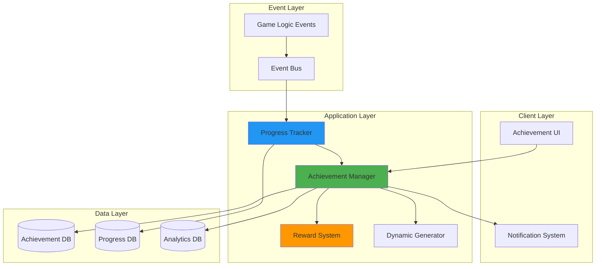

# Tài liệu Thiết kế - Hệ thống Thành tựu

## Tổng quan

Hệ thống Thành tựu được thiết kế theo kiến trúc module hóa với các thành phần độc lập có thể mở rộng. Hệ thống sử dụng mô hình event-driven để theo dõi hành vi người chơi và cập nhật tiến trình thành tựu theo thời gian thực. Thiết kế tập trung vào hiệu suất, khả năng mở rộng, và trải nghiệm người dùng mượt mà.

### Mục tiêu Thiết kế

1. **Hiệu suất cao**: Xử lý cập nhật tiến trình trong < 100ms
2. **Khả năng mở rộng**: Hỗ trợ hàng nghìn thành tựu và hàng triệu người chơi
3. **Tính module**: Các thành phần độc lập, dễ bảo trì và mở rộng
4. **Trải nghiệm mượt mà**: Phản hồi tức thì với hiệu ứng hình ảnh hấp dẫn
5. **Phân tích sâu**: Thu thập dữ liệu chi tiết về hành vi người chơi

## Kiến trúc

### Sơ đồ Kiến trúc Tổng thể



### Luồng Dữ liệu Chính

1. **Luồng Cập nhật Tiến trình**:
   - Game Logic phát sự kiện → Event Bus → Progress Tracker
   - Progress Tracker cập nhật DB → Kiểm tra điều kiện hoàn thành
   - Nếu hoàn thành → Achievement Manager → Notification System

2. **Luồng Nhận Thưởng**:
   - Player nhấn "Claim" → Achievement Manager → Reward System
   - Reward System cập nhật inventory/currency → Phản hồi UI

3. **Luồng Thành tựu Động**:
   - Dynamic Generator phân tích hành vi → Tạo thành tựu mới
   - Lưu vào Achievement DB → Thông báo Player

## Thành phần và Giao diện

### 1. Achievement Manager (Core)

**Trách nhiệm**: Điều phối tất cả các hoạt động liên quan đến thành tựu

**Interface**:
```typescript
interface IAchievementManager {
  // Quản lý thành tựu
  getAchievement(id: string): Achievement;
  getAchievementsByCategory(category: AchievementCategory): Achievement[];
  getAllAchievements(): Achievement[];
  
  // Quản lý tiến trình
  getPlayerProgress(playerId: string, achievementId: string): Progress;
  updateProgress(playerId: string, achievementId: string, value: number): void;
  
  // Phần thưởng
  claimReward(playerId: string, achievementId: string): RewardResult;
  
  // Lọc và sắp xếp
  filterAchievements(filter: AchievementFilter): Achievement[];
  sortAchievements(achievements: Achievement[], sortBy: SortCriteria): Achievement[];
}
```

**Thuộc tính chính**:

- Cache thành tựu trong memory để truy cập nhanh
- Sử dụng Observer pattern để thông báo UI khi có thay đổi
- Xử lý bất đồng bộ để không block game loop

### 2. Progress Tracker

**Trách nhiệm**: Theo dõi và cập nhật tiến trình của người chơi

**Interface**:
```typescript
interface IProgressTracker {
  // Cập nhật tiến trình
  incrementProgress(playerId: string, achievementId: string, amount: number): void;
  setProgress(playerId: string, achievementId: string, value: number): void;
  
  // Truy vấn tiến trình
  getProgress(playerId: string, achievementId: string): Progress;
  getAllProgress(playerId: string): Progress[];
  
  // Sự kiện
  onProgressUpdated(callback: (progress: Progress) => void): void;
  onAchievementCompleted(callback: (achievement: Achievement) => void): void;
}
```

**Cơ chế hoạt động**:
- Lắng nghe các game events thông qua Event Bus
- Mapping events → achievements bằng Event-Achievement Registry
- Batch updates mỗi 100ms để tối ưu hiệu suất
- Sử dụng optimistic updates cho UI (cập nhật ngay, sync sau)

### 3. Reward System

**Trách nhiệm**: Quản lý và phát thưởng cho người chơi

**Interface**:
```typescript
interface IRewardSystem {
  // Phát thưởng
  grantReward(playerId: string, reward: Reward): RewardResult;
  grantMultipleRewards(playerId: string, rewards: Reward[]): RewardResult[];
  
  // Kiểm tra
  canClaimReward(playerId: string, achievementId: string): boolean;
  getRewardHistory(playerId: string, limit: number): RewardHistory[];
}
```

**Loại phần thưởng**:
```typescript
enum RewardType {
  CURRENCY = 'currency',      // Tiền tệ trong game
  ITEM = 'item',              // Vật phẩm tiêu hao
  EXPERIENCE = 'experience',  // Điểm kinh nghiệm
  COSMETIC = 'cosmetic'       // Vật phẩm trang trí
}

interface Reward {
  type: RewardType;
  id: string;
  amount: number;
  metadata?: Record<string, any>;
}
```

### 4. Dynamic Achievement Generator

**Trách nhiệm**: Tạo thành tựu cá nhân hóa dựa trên hành vi người chơi

**Interface**:
```typescript
interface IDynamicGenerator {
  // Phân tích và tạo
  analyzePlayerBehavior(playerId: string): BehaviorProfile;
  generateAchievements(profile: BehaviorProfile): Achievement[];
  
  // Quản lý thành tựu động
  getActiveDynamicAchievements(playerId: string): Achievement[];
  expireDynamicAchievement(achievementId: string): void;
}
```

**Thuật toán phân tích**:
1. Thu thập dữ liệu 7 ngày gần nhất
2. Phát hiện patterns: nhân vật thường dùng, thời gian chơi, phong cách
3. Xác định "gaps" - những gì người chơi chưa thử
4. Tạo thành tựu khuyến khích thử nghiệm với phần thưởng hấp dẫn

### 5. Notification System

**Trách nhiệm**: Hiển thị thông báo khi hoàn thành thành tựu

**Interface**:
```typescript
interface INotificationSystem {
  // Hiển thị thông báo
  showUnlockNotification(achievement: Achievement): void;
  showRewardNotification(rewards: Reward[]): void;
  
  // Cấu hình
  setNotificationDuration(duration: number): void;
  enableSound(enabled: boolean): void;
  enableAnimation(enabled: boolean): void;
}
```

**Thiết kế UI**:
- Popup xuất hiện từ góc trên bên phải
- Animation: slide-in + scale với easing
- Hiệu ứng particle khi xuất hiện
- Âm thanh "achievement unlock" (< 1s)
- Auto-dismiss sau 5s hoặc click để đóng

## Database Architecture

### Technology Stack

**Primary Database**: PostgreSQL 14+
- JSONB support for flexible achievement requirements and metadata
- ACID transactions for reward granting
- Efficient indexing for achievement queries
- Excellent performance for analytics queries

**Cache Layer**: Redis 7+
- Achievement definitions caching (TTL: 1 hour)
- Player progress caching (TTL: 5 minutes, write-through)
- Real-time progress updates via pub/sub
- Event streaming for achievement unlocks

**Connection Pooling**: PgBouncer

### Database Schema

```sql
-- Achievement schema
CREATE SCHEMA IF NOT EXISTS achievement;

-- Achievements table
CREATE TABLE achievement.achievements (
    id VARCHAR(50) PRIMARY KEY,
    name VARCHAR(200) NOT NULL,
    description TEXT,
    category VARCHAR(50) NOT NULL,
    tier VARCHAR(20) NOT NULL,
    requirements JSONB NOT NULL,
    target_value INT NOT NULL,
    rewards JSONB NOT NULL,
    icon VARCHAR(255),
    rarity VARCHAR(20) NOT NULL,
    is_hidden BOOLEAN DEFAULT FALSE,
    is_dynamic BOOLEAN DEFAULT FALSE,
    created_at TIMESTAMP DEFAULT CURRENT_TIMESTAMP,
    expires_at TIMESTAMP,
    INDEX idx_category (category),
    INDEX idx_tier (tier),
    INDEX idx_rarity (rarity),
    INDEX idx_dynamic (is_dynamic, expires_at) WHERE is_dynamic = TRUE,
    CHECK (category IN ('combat', 'exploration', 'collection', 'social', 'mastery')),
    CHECK (tier IN ('daily', 'weekly', 'mid_tier', 'mastery')),
    CHECK (rarity IN ('common', 'rare', 'epic', 'legendary'))
);

-- Player progress table
CREATE TABLE achievement.player_progress (
    progress_id VARCHAR(50) PRIMARY KEY,
    player_id VARCHAR(50) NOT NULL,
    achievement_id VARCHAR(50) NOT NULL REFERENCES achievement.achievements(id),
    current_value INT DEFAULT 0,
    target_value INT NOT NULL,
    percentage DECIMAL(5,2) GENERATED ALWAYS AS (
        CASE WHEN target_value > 0 
        THEN (current_value::DECIMAL / target_value * 100)
        ELSE 0 END
    ) STORED,
    status VARCHAR(20) DEFAULT 'not_started',
    started_at TIMESTAMP DEFAULT CURRENT_TIMESTAMP,
    completed_at TIMESTAMP,
    last_updated_at TIMESTAMP DEFAULT CURRENT_TIMESTAMP,
    UNIQUE (player_id, achievement_id),
    INDEX idx_player_achievements (player_id, status),
    INDEX idx_achievement_progress (achievement_id, status),
    INDEX idx_player_completed (player_id, completed_at) WHERE status = 'completed',
    CHECK (status IN ('not_started', 'in_progress', 'completed', 'claimed'))
);

-- Achievement analytics table
CREATE TABLE achievement.analytics (
    analytics_id VARCHAR(50) PRIMARY KEY,
    achievement_id VARCHAR(50) NOT NULL REFERENCES achievement.achievements(id),
    total_players INT DEFAULT 0,
    completed_count INT DEFAULT 0,
    completion_rate DECIMAL(5,2),
    average_time_to_complete BIGINT,
    abandonment_rate DECIMAL(5,2),
    last_updated TIMESTAMP DEFAULT CURRENT_TIMESTAMP,
    UNIQUE (achievement_id),
    INDEX idx_completion_rate (completion_rate DESC)
);

-- Reward claims table
CREATE TABLE achievement.reward_claims (
    claim_id VARCHAR(50) PRIMARY KEY,
    player_id VARCHAR(50) NOT NULL,
    achievement_id VARCHAR(50) NOT NULL REFERENCES achievement.achievements(id),
    rewards JSONB NOT NULL,
    claimed_at TIMESTAMP DEFAULT CURRENT_TIMESTAMP,
    UNIQUE (player_id, achievement_id),
    INDEX idx_player_claims (player_id, claimed_at DESC)
);
```

### Redis Cache Structure

```
# Achievement definitions cache
achievement:def:{id} -> JSON (TTL: 1 hour)

# Achievement list by category
achievement:category:{category} -> JSON Array (TTL: 1 hour)

# Player progress cache
achievement:progress:{player_id}:{achievement_id} -> JSON (TTL: 5 minutes)

# Player achievement list cache
achievement:player:{player_id} -> JSON Array (TTL: 5 minutes)

# Event stream for real-time updates
achievement:events -> Pub/Sub channel
```

## Mô hình Dữ liệu

### Achievement Entity

```typescript
interface Achievement {
  id: string;
  name: string;
  description: string;
  category: AchievementCategory;
  tier: AchievementTier;
  
  // Yêu cầu
  requirements: Requirement[];
  targetValue: number;
  
  // Phần thưởng
  rewards: Reward[];
  
  // Metadata
  icon: string;
  rarity: Rarity;
  isHidden: boolean;
  isDynamic: boolean;
  
  // Thời gian
  createdAt: Date;
  expiresAt?: Date;
}

enum AchievementCategory {
  COMBAT = 'combat',
  EXPLORATION = 'exploration',
  COLLECTION = 'collection',
  SOCIAL = 'social',
  MASTERY = 'mastery'
}

enum AchievementTier {
  DAILY = 'daily',
  WEEKLY = 'weekly',
  MID_TIER = 'mid_tier',
  MASTERY = 'mastery'
}

enum Rarity {
  COMMON = 'common',
  RARE = 'rare',
  EPIC = 'epic',
  LEGENDARY = 'legendary'
}
```

### Progress Entity

```typescript
interface Progress {
  playerId: string;
  achievementId: string;
  
  currentValue: number;
  targetValue: number;
  percentage: number;
  
  status: ProgressStatus;
  
  startedAt: Date;
  completedAt?: Date;
  lastUpdatedAt: Date;
}

enum ProgressStatus {
  NOT_STARTED = 'not_started',
  IN_PROGRESS = 'in_progress',
  COMPLETED = 'completed',
  CLAIMED = 'claimed'
}
```

### Requirement Entity

```typescript
interface Requirement {
  type: RequirementType;
  eventName: string;
  condition?: Condition;
  targetValue: number;
}

enum RequirementType {
  COUNT = 'count',           // Đếm số lần
  ACCUMULATE = 'accumulate', // Tích lũy giá trị
  REACH = 'reach',           // Đạt mốc
  SEQUENCE = 'sequence'      // Chuỗi hành động
}

interface Condition {
  field: string;
  operator: 'eq' | 'gt' | 'lt' | 'gte' | 'lte' | 'in';
  value: any;
}
```

### Analytics Entity

```typescript
interface AchievementAnalytics {
  achievementId: string;
  
  totalPlayers: number;
  completedCount: number;
  completionRate: number;
  
  averageTimeToComplete: number; // milliseconds
  abandonmentRate: number;
  
  lastUpdated: Date;
}
```

## Xử lý Lỗi

### Chiến lược Xử lý Lỗi

1. **Network Errors**:
   - Retry với exponential backoff (3 lần)
   - Queue updates locally nếu offline
   - Sync khi kết nối lại

2. **Data Inconsistency**:
   - Server là source of truth
   - Client reconciliation khi phát hiện mismatch
   - Log conflicts để phân tích

3. **Invalid State**:
   - Validation ở cả client và server
   - Rollback transaction nếu validation fail
   - Thông báo lỗi rõ ràng cho người chơi

4. **Performance Issues**:
   - Circuit breaker pattern cho external services
   - Fallback to cached data
   - Graceful degradation (tắt features không quan trọng)

### Error Codes

```typescript
enum AchievementErrorCode {
  ACHIEVEMENT_NOT_FOUND = 'ACH_001',
  PROGRESS_NOT_FOUND = 'ACH_002',
  ALREADY_CLAIMED = 'ACH_003',
  NOT_COMPLETED = 'ACH_004',
  INVALID_REQUIREMENT = 'ACH_005',
  REWARD_GRANT_FAILED = 'ACH_006',
  DATABASE_ERROR = 'ACH_007',
  NETWORK_ERROR = 'ACH_008'
}
```

## Chiến lược Testing

### 1. Unit Tests

**Mục tiêu**: Test từng component độc lập

**Coverage**:
- Achievement Manager: CRUD operations, filtering, sorting
- Progress Tracker: Update logic, completion detection
- Reward System: Grant rewards, validation
- Dynamic Generator: Behavior analysis, achievement generation

**Tools**: Jest, Mocha, hoặc framework tương đương

### 2. Integration Tests

**Mục tiêu**: Test tương tác giữa các components

**Scenarios**:
- Event → Progress Update → Completion → Notification
- Claim Reward → Update Inventory → UI Refresh
- Dynamic Achievement Creation → Assignment → Expiration

### 3. Performance Tests

**Mục tiêu**: Đảm bảo đáp ứng yêu cầu hiệu suất

**Metrics**:
- Progress update latency < 100ms (p95)
- Notification display < 500ms
- Achievement list load < 2s với 1000+ achievements
- Support 10,000 concurrent users

**Tools**: JMeter, k6, hoặc Artillery

### 4. UI/UX Tests

**Mục tiêu**: Đảm bảo trải nghiệm người dùng mượt mà

**Checklist**:
- Animations chạy ở 60fps
- Responsive trên các kích thước màn hình
- Accessibility (keyboard navigation, screen readers)
- Visual regression testing

### 5. End-to-End Tests

**Mục tiêu**: Test toàn bộ user journey

**Scenarios**:
- Player hoàn thành achievement từ đầu đến cuối
- Daily/Weekly reset flow
- Dynamic achievement lifecycle
- Multi-device sync

## Tối ưu Hiệu suất

### 1. Caching Strategy

**Multi-level Cache**:
```
L1: In-memory cache (Redis) - TTL 5 minutes
L2: Application cache - TTL 1 hour  
L3: Database
```

**Cache Keys**:
- `achievement:{id}` - Single achievement
- `achievements:category:{category}` - By category
- `progress:{playerId}:{achievementId}` - Player progress
- `analytics:{achievementId}` - Analytics data

### 2. Database Optimization

**Indexes**:
```sql
-- Achievement queries
CREATE INDEX idx_achievement_category ON achievements(category);
CREATE INDEX idx_achievement_tier ON achievements(tier);
CREATE INDEX idx_achievement_expires ON achievements(expiresAt);

-- Progress queries
CREATE INDEX idx_progress_player ON progress(playerId);
CREATE INDEX idx_progress_status ON progress(playerId, status);
CREATE INDEX idx_progress_updated ON progress(lastUpdatedAt);
```

**Partitioning**:
- Partition progress table by playerId (hash)
- Partition analytics by date (range)

### 3. Event Processing

**Batch Processing**:
- Collect events trong 100ms window
- Process batch một lần
- Reduce DB writes từ N → 1

**Async Processing**:
- Non-critical updates (analytics) → Message queue
- Critical updates (progress) → Sync
- Notification → Async

### 4. Frontend Optimization

**Lazy Loading**:
- Load achievements on-demand khi scroll
- Pagination: 20 items per page
- Virtual scrolling cho danh sách dài

**Asset Optimization**:
- Sprite sheets cho achievement icons
- WebP format cho images
- Preload critical assets

## Bảo mật

### 1. Authorization

**Access Control**:
- Players chỉ có thể xem/update progress của chính mình
- Admin có thể xem tất cả data
- Analytics API yêu cầu API key

### 2. Validation

**Server-side Validation**:
- Validate tất cả progress updates
- Check achievement requirements trước khi mark completed
- Verify reward eligibility trước khi grant

**Anti-cheat**:
- Rate limiting: Max 100 progress updates/minute/player
- Anomaly detection: Flag suspicious patterns
- Server-authoritative: Client không thể tự set progress

### 3. Data Protection

**Encryption**:
- Encrypt sensitive data at rest
- HTTPS cho tất cả API calls
- Secure token-based authentication

## Khả năng Mở rộng

### 1. Horizontal Scaling

**Stateless Services**:
- Achievement Manager, Progress Tracker → Stateless
- Scale bằng cách thêm instances
- Load balancer phân phối traffic

**Database Sharding**:
- Shard progress table theo playerId
- Shard analytics theo achievementId
- Cross-shard queries qua aggregation service

### 2. Microservices Architecture (Optional)

**Service Breakdown**:
- Achievement Service: CRUD achievements
- Progress Service: Track progress
- Reward Service: Grant rewards
- Analytics Service: Collect & analyze data
- Notification Service: Send notifications

**Communication**:
- Sync: REST API hoặc gRPC
- Async: Message queue (RabbitMQ, Kafka)

### 3. Multi-region Support

**Data Replication**:
- Master-slave replication cho read-heavy workloads
- Multi-master cho write-heavy regions
- CDN cho static assets (icons, images)

## Monitoring & Observability

### 1. Metrics

**Key Metrics**:
- Achievement completion rate by tier/category
- Average time to complete
- Daily/Weekly active achievements
- Reward claim rate
- API latency (p50, p95, p99)
- Error rate by error code

**Tools**: Prometheus, Grafana, Datadog

### 2. Logging

**Log Levels**:
- ERROR: System errors, failed operations
- WARN: Validation failures, retries
- INFO: Achievement completions, rewards granted
- DEBUG: Detailed flow for troubleshooting

**Structured Logging**:
```json
{
  "timestamp": "2025-10-26T10:30:00Z",
  "level": "INFO",
  "service": "achievement-service",
  "event": "achievement_completed",
  "playerId": "player123",
  "achievementId": "ach456",
  "duration": 3600000
}
```

### 3. Alerting

**Alert Rules**:
- Error rate > 5% trong 5 phút
- API latency p95 > 500ms
- Database connection pool exhausted
- Cache hit rate < 80%
- Reward grant failures > 10/minute

## Roadmap & Future Enhancements

### Phase 1 (MVP)
- Core achievement system
- Progress tracking
- Basic rewards
- UI/Notifications

### Phase 2
- Dynamic achievements
- Analytics dashboard
- Daily/Weekly achievements
- Profile showcase

### Phase 3
- Collaborative achievements (Clan)
- Player-created challenges
- Advanced analytics
- A/B testing framework

### Phase 4
- Cross-game achievements
- Blockchain integration (NFT rewards)
- AI-powered personalization
- Social features (leaderboards, sharing)
