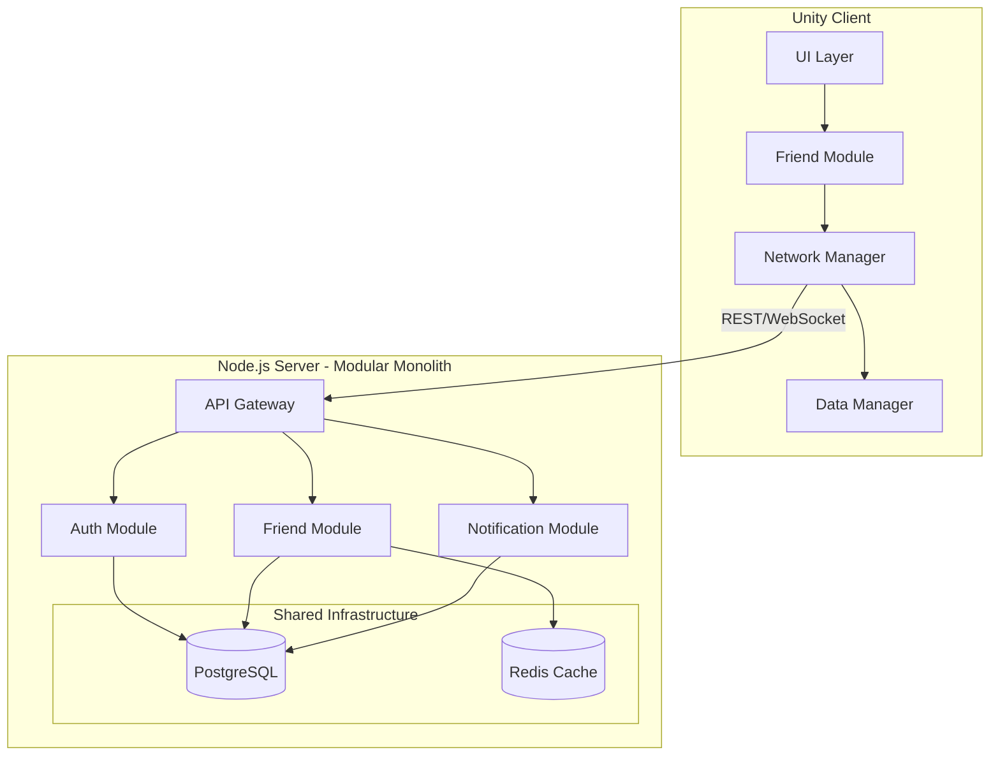

# Tài liệu Thiết kế - Hệ thống Bạn bè

## Tổng quan

Hệ thống Bạn bè được thiết kế theo kiến trúc Modular Monolith cho server (Node.js + TypeScript) và module-based cho client (Unity C#), sử dụng PostgreSQL làm cơ sở dữ liệu. Hệ thống cung cấp các chức năng tìm kiếm và kết nối bạn bè, quản lý danh sách bạn bè với hiệu suất cao và bảo mật tốt.

### ⚠️ Important Notes về Database Schema

**Unified Users Table:**
- Hệ thống này sử dụng bảng `users` được tạo bởi authentication-system
- KHÔNG tạo bảng `players` riêng để tránh duplicate data
- Bảng `users` đã bao gồm tất cả profile fields cần thiết: display_name, avatar_url, level, online_status, privacy_settings

**Naming Convention:**
- Database: Sử dụng `user_id` thay vì `player_id` trong foreign keys
- Code: Có thể giữ tên `playerId` trong code để dễ hiểu (player = user trong game context)
- Models: `PlayerAccount` interface là alias cho User entity với game-specific context

### Công nghệ Sử dụng

- **Server**: Node.js 18+, TypeScript 5+, Express.js
- **Client**: Unity 2021.3+, C# 9+
- **Database**: PostgreSQL 14+
- **Communication**: REST API, WebSocket (Socket.io)
- **Authentication**: JWT tokens
- **Caching**: Redis (optional, for performance)

## Kiến trúc

### Kiến trúc Tổng thể




### Server Architecture - Modular Monolith

Server được tổ chức theo Modular Monolith pattern với các module độc lập:

```
server/
├── src/
│   ├── modules/
│   │   ├── auth/                    # Authentication Module
│   │   │   ├── controllers/
│   │   │   ├── services/
│   │   │   ├── repositories/
│   │   │   ├── models/
│   │   │   └── auth.module.ts
│   │   ├── friend/                  # Friend Module
│   │   │   ├── controllers/
│   │   │   │   ├── friend.controller.ts
│   │   │   │   └── friend-request.controller.ts
│   │   │   ├── services/
│   │   │   │   ├── friend.service.ts
│   │   │   │   ├── friend-request.service.ts
│   │   │   │   └── friend-search.service.ts
│   │   │   ├── repositories/
│   │   │   │   ├── friend.repository.ts
│   │   │   │   └── friend-request.repository.ts
│   │   │   ├── models/
│   │   │   │   ├── friend.model.ts
│   │   │   │   └── friend-request.model.ts
│   │   │   ├── validators/
│   │   │   └── friend.module.ts
│   │   ├── notification/            # Notification Module
│   │   │   ├── controllers/
│   │   │   ├── services/
│   │   │   ├── gateways/           # WebSocket handlers
│   │   │   └── notification.module.ts
│   │   └── user-profile/            # User Profile Module (extends auth User)
│   │       ├── controllers/
│   │       │   └── user-profile.controller.ts
│   │       ├── services/
│   │       │   └── user-profile.service.ts
│   │       ├── repositories/
│   │       │   └── user-profile.repository.ts
│   │       └── user-profile.module.ts
│   ├── shared/                      # Shared Infrastructure
│   │   ├── database/
│   │   │   ├── database.provider.ts
│   │   │   └── migrations/
│   │   ├── cache/
│   │   │   └── redis.provider.ts
│   │   ├── middleware/
│   │   │   ├── auth.middleware.ts
│   │   │   ├── error.middleware.ts
│   │   │   └── validation.middleware.ts
│   │   ├── utils/
│   │   └── types/
│   ├── config/
│   │   └── config.ts
│   └── app.ts
└── package.json
```


### Client Architecture - Unity Module

Client được tổ chức theo module pattern trong Unity:

```
Client/Assets/
├── Modules/
│   └── FriendSystem/
│       ├── Scripts/
│       │   ├── Core/
│       │   │   ├── FriendModule.cs           # Module entry point
│       │   │   ├── FriendManager.cs          # Main manager
│       │   │   └── FriendSystemConfig.cs     # Configuration
│       │   ├── Models/
│       │   │   ├── PlayerAccount.cs
│       │   │   ├── FriendData.cs
│       │   │   ├── FriendRequest.cs
│       │   │   └── FriendListFilter.cs
│       │   ├── Services/
│       │   │   ├── FriendService.cs          # API communication
│       │   │   ├── FriendRequestService.cs
│       │   │   └── FriendSearchService.cs
│       │   ├── Network/
│       │   │   ├── FriendApiClient.cs        # REST API client
│       │   │   ├── FriendSocketClient.cs     # WebSocket client
│       │   │   └── NetworkModels/            # DTOs
│       │   ├── UI/
│       │   │   ├── FriendListPanel.cs
│       │   │   ├── FriendSearchPanel.cs
│       │   │   ├── FriendRequestPanel.cs
│       │   │   ├── FriendProfilePanel.cs
│       │   │   └── Components/
│       │   │       ├── FriendListItem.cs
│       │   │       └── FriendRequestItem.cs
│       │   ├── Data/
│       │   │   ├── FriendDataManager.cs      # Local data cache
│       │   │   └── FriendDataStore.cs
│       │   └── Events/
│       │       └── FriendSystemEvents.cs     # Event definitions
│       ├── Prefabs/
│       │   ├── UI/
│       │   │   ├── FriendListPanel.prefab
│       │   │   ├── FriendSearchPanel.prefab
│       │   │   └── FriendRequestPanel.prefab
│       │   └── Components/
│       ├── Resources/
│       │   ├── Icons/
│       │   └── Sprites/
│       └── FriendSystem.asmdef          # Assembly definition
```

## Components và Interfaces


### Server Components

#### 1. Friend Module

**FriendService** - Business logic cho quản lý bạn bè
```typescript
interface IFriendService {
  getFriendList(playerId: string, filter?: FriendListFilter): Promise<Friend[]>;
  removeFriend(playerId: string, friendId: string): Promise<void>;
  getFriendProfile(playerId: string, friendId: string): Promise<FriendProfile>;
  updateFriendStatus(playerId: string, status: OnlineStatus): Promise<void>;
  getFriendCount(playerId: string): Promise<{ current: number; max: number }>;
}
```

**FriendRequestService** - Xử lý lời mời kết bạn
```typescript
interface IFriendRequestService {
  sendFriendRequest(fromPlayerId: string, toPlayerId: string): Promise<FriendRequest>;
  acceptFriendRequest(requestId: string): Promise<void>;
  rejectFriendRequest(requestId: string): Promise<void>;
  getPendingRequests(playerId: string): Promise<FriendRequest[]>;
  cancelFriendRequest(requestId: string): Promise<void>;
}
```

**FriendSearchService** - Tìm kiếm người chơi
```typescript
interface IFriendSearchService {
  searchByUsername(username: string, limit?: number): Promise<PlayerSearchResult[]>;
  searchById(playerId: string): Promise<PlayerSearchResult | null>;
  getRecommendedFriends(playerId: string, limit?: number): Promise<PlayerSearchResult[]>;
}
```

**FriendRepository** - Data access layer
```typescript
interface IFriendRepository {
  findFriendsByPlayerId(playerId: string): Promise<Friend[]>;
  addFriend(playerId: string, friendId: string): Promise<void>;
  removeFriend(playerId: string, friendId: string): Promise<void>;
  isFriend(playerId: string, friendId: string): Promise<boolean>;
  getFriendCount(playerId: string): Promise<number>;
}
```

#### 2. User Profile Module

**UserProfileService** - Quản lý profile người chơi (extends User from auth)
```typescript
interface IUserProfileService {
  // Note: User account creation is handled by auth module
  getUserById(userId: string): Promise<User | null>;
  updateProfile(userId: string, data: UpdateProfileDto): Promise<User>;
  updateOnlineStatus(userId: string, status: OnlineStatus): Promise<void>;
  getUserBasicInfo(userId: string): Promise<UserBasicInfo>;
}

interface UpdateProfileDto {
  displayName?: string;
  avatarUrl?: string;
  privacySettings?: PrivacySettings;
}
```

#### 3. Notification Module

**NotificationGateway** - WebSocket handler cho real-time notifications
```typescript
interface INotificationGateway {
  sendFriendRequestNotification(toPlayerId: string, request: FriendRequest): void;
  sendFriendAcceptedNotification(toPlayerId: string, friend: Friend): void;
  sendFriendOnlineNotification(toPlayerId: string, friendId: string): void;
  sendFriendOfflineNotification(toPlayerId: string, friendId: string): void;
}
```


### Client Components

#### 1. FriendManager (Core)

Singleton manager quản lý toàn bộ Friend System
```csharp
public interface IFriendManager
{
    // Initialization
    void Initialize(FriendSystemConfig config);
    
    // Friend List Management
    Task<List<FriendData>> GetFriendListAsync(FriendListFilter filter = null);
    Task RemoveFriendAsync(string friendId);
    Task<FriendProfile> GetFriendProfileAsync(string friendId);
    
    // Friend Requests
    Task<FriendRequest> SendFriendRequestAsync(string targetPlayerId);
    Task AcceptFriendRequestAsync(string requestId);
    Task RejectFriendRequestAsync(string requestId);
    Task<List<FriendRequest>> GetPendingRequestsAsync();
    
    // Search
    Task<List<PlayerSearchResult>> SearchPlayersByUsernameAsync(string username);
    Task<PlayerSearchResult> SearchPlayerByIdAsync(string playerId);
    
    // Events
    event Action<FriendData> OnFriendAdded;
    event Action<string> OnFriendRemoved;
    event Action<FriendRequest> OnFriendRequestReceived;
    event Action<string, OnlineStatus> OnFriendStatusChanged;
}
```

#### 2. FriendService (Network Layer)

Xử lý communication với server
```csharp
public interface IFriendService
{
    Task<ApiResponse<List<FriendData>>> GetFriendListAsync(FriendListFilter filter);
    Task<ApiResponse<bool>> RemoveFriendAsync(string friendId);
    Task<ApiResponse<FriendProfile>> GetFriendProfileAsync(string friendId);
    Task<ApiResponse<FriendRequest>> SendFriendRequestAsync(string targetPlayerId);
    Task<ApiResponse<bool>> AcceptFriendRequestAsync(string requestId);
    Task<ApiResponse<bool>> RejectFriendRequestAsync(string requestId);
    Task<ApiResponse<List<FriendRequest>>> GetPendingRequestsAsync();
}
```

#### 3. FriendDataManager (Local Cache)

Quản lý cache local để giảm network calls
```csharp
public interface IFriendDataManager
{
    void CacheFriendList(List<FriendData> friends);
    List<FriendData> GetCachedFriendList();
    void UpdateFriendStatus(string friendId, OnlineStatus status);
    void AddFriend(FriendData friend);
    void RemoveFriend(string friendId);
    void ClearCache();
    bool IsCacheValid();
}
```

#### 4. FriendSocketClient (Real-time Communication)

WebSocket client cho notifications
```csharp
public interface IFriendSocketClient
{
    void Connect(string token);
    void Disconnect();
    bool IsConnected { get; }
    
    event Action<FriendRequest> OnFriendRequestReceived;
    event Action<FriendData> OnFriendAccepted;
    event Action<string> OnFriendOnline;
    event Action<string> OnFriendOffline;
}
```


## Data Models

### Database Schema (PostgreSQL)

```sql
-- NOTE: The 'users' table is created by authentication-system with unified schema
-- It includes: id, username, password_hash, display_name, avatar_url, level, 
-- online_status, last_online_at, privacy_settings, created_at, updated_at

-- Friendships table (bidirectional relationship)
CREATE TABLE friendships (
    id UUID PRIMARY KEY DEFAULT gen_random_uuid(),
    user_id UUID NOT NULL REFERENCES users(id) ON DELETE CASCADE,
    friend_id UUID NOT NULL REFERENCES users(id) ON DELETE CASCADE,
    created_at TIMESTAMP DEFAULT CURRENT_TIMESTAMP,
    
    CONSTRAINT no_self_friendship CHECK (user_id != friend_id),
    CONSTRAINT unique_friendship UNIQUE (user_id, friend_id)
);

CREATE INDEX idx_friendships_user_id ON friendships(user_id);
CREATE INDEX idx_friendships_friend_id ON friendships(friend_id);

-- Friend requests table
CREATE TABLE friend_requests (
    id UUID PRIMARY KEY DEFAULT gen_random_uuid(),
    from_user_id UUID NOT NULL REFERENCES users(id) ON DELETE CASCADE,
    to_user_id UUID NOT NULL REFERENCES users(id) ON DELETE CASCADE,
    status VARCHAR(20) DEFAULT 'pending',
    message TEXT,
    created_at TIMESTAMP DEFAULT CURRENT_TIMESTAMP,
    updated_at TIMESTAMP DEFAULT CURRENT_TIMESTAMP,
    
    CONSTRAINT no_self_request CHECK (from_user_id != to_user_id),
    CONSTRAINT valid_request_status CHECK (status IN ('pending', 'accepted', 'rejected', 'cancelled')),
    CONSTRAINT unique_pending_request UNIQUE (from_user_id, to_user_id, status)
);

CREATE INDEX idx_friend_requests_to_user ON friend_requests(to_user_id, status);
CREATE INDEX idx_friend_requests_from_user ON friend_requests(from_user_id, status);

-- Blocked users table
CREATE TABLE blocked_users (
    id UUID PRIMARY KEY DEFAULT gen_random_uuid(),
    user_id UUID NOT NULL REFERENCES users(id) ON DELETE CASCADE,
    blocked_user_id UUID NOT NULL REFERENCES users(id) ON DELETE CASCADE,
    reason TEXT,
    created_at TIMESTAMP DEFAULT CURRENT_TIMESTAMP,
    
    CONSTRAINT no_self_block CHECK (user_id != blocked_user_id),
    CONSTRAINT unique_block UNIQUE (user_id, blocked_user_id)
);

CREATE INDEX idx_blocked_users_user_id ON blocked_users(user_id);
```


### Server TypeScript Models

```typescript
// User Model (from auth module, extended with profile fields)
// This is the same User entity created by authentication-system
export interface User {
  // Authentication fields
  id: string;
  username: string;
  passwordHash: string;  // Never exposed in API responses
  
  // Profile fields
  displayName?: string;
  avatarUrl?: string;
  level: number;
  onlineStatus: OnlineStatus;
  lastOnlineAt?: Date;
  privacySettings: PrivacySettings;
  
  // Timestamps
  createdAt: Date;
  updatedAt: Date;
}

// Alias for game context (same as User but without passwordHash)
export type PlayerAccount = Omit<User, 'passwordHash'>

export enum OnlineStatus {
  ONLINE = 'online',
  OFFLINE = 'offline',
  AWAY = 'away',
  BUSY = 'busy'
}

export interface PrivacySettings {
  allowFriendRequests: boolean;
  showOnlineStatus: boolean;
  showLevel: boolean;
}

// Friend Model
export interface Friend {
  id: string;
  playerId: string;
  friendId: string;
  friendInfo: PlayerBasicInfo;
  createdAt: Date;
}

export interface UserBasicInfo {
  id: string;
  username: string;
  displayName: string;
  avatarUrl?: string;
  level: number;
  onlineStatus: OnlineStatus;
}

// Alias for game context
export type PlayerBasicInfo = UserBasicInfo;

// Friend Request Model
export interface FriendRequest {
  id: string;
  fromPlayerId: string;
  toPlayerId: string;
  fromPlayerInfo: PlayerBasicInfo;
  status: FriendRequestStatus;
  message?: string;
  createdAt: Date;
  updatedAt: Date;
}

export enum FriendRequestStatus {
  PENDING = 'pending',
  ACCEPTED = 'accepted',
  REJECTED = 'rejected',
  CANCELLED = 'cancelled'
}

// Search Result Model
export interface PlayerSearchResult {
  id: string;
  username: string;
  displayName: string;
  avatarUrl?: string;
  level: number;
  isFriend: boolean;
  hasPendingRequest: boolean;
}

// Filter Models
export interface FriendListFilter {
  searchTerm?: string;
  sortBy?: 'name' | 'level' | 'status';
  sortOrder?: 'asc' | 'desc';
  onlineOnly?: boolean;
}
```


### Client C# Models

```csharp
// Player Account
[Serializable]
public class PlayerAccount
{
    public string Id;
    public string Username;
    public string DisplayName;
    public string AvatarUrl;
    public int Level;
    public OnlineStatus OnlineStatus;
    public DateTime LastOnlineAt;
    public PrivacySettings PrivacySettings;
}

public enum OnlineStatus
{
    Online,
    Offline,
    Away,
    Busy
}

[Serializable]
public class PrivacySettings
{
    public bool AllowFriendRequests = true;
    public bool ShowOnlineStatus = true;
    public bool ShowLevel = true;
}

// Friend Data
[Serializable]
public class FriendData
{
    public string Id;
    public string PlayerId;
    public string FriendId;
    public PlayerBasicInfo FriendInfo;
    public DateTime CreatedAt;
}

[Serializable]
public class PlayerBasicInfo
{
    public string Id;
    public string Username;
    public string DisplayName;
    public string AvatarUrl;
    public int Level;
    public OnlineStatus OnlineStatus;
}

// Friend Request
[Serializable]
public class FriendRequest
{
    public string Id;
    public string FromPlayerId;
    public string ToPlayerId;
    public PlayerBasicInfo FromPlayerInfo;
    public FriendRequestStatus Status;
    public string Message;
    public DateTime CreatedAt;
}

public enum FriendRequestStatus
{
    Pending,
    Accepted,
    Rejected,
    Cancelled
}

// Search Result
[Serializable]
public class PlayerSearchResult
{
    public string Id;
    public string Username;
    public string DisplayName;
    public string AvatarUrl;
    public int Level;
    public bool IsFriend;
    public bool HasPendingRequest;
}

// Filter
[Serializable]
public class FriendListFilter
{
    public string SearchTerm;
    public SortBy SortBy = SortBy.Name;
    public SortOrder SortOrder = SortOrder.Ascending;
    public bool OnlineOnly = false;
}

public enum SortBy { Name, Level, Status }
public enum SortOrder { Ascending, Descending }
```


## API Endpoints

### REST API

#### User Profile Endpoints

```
# Note: User creation is handled by auth module (POST /api/auth/register)
GET    /api/v1/users/:id                  # Get user profile by ID
PUT    /api/v1/users/:id/profile          # Update user profile
PATCH  /api/v1/users/:id/status           # Update online status
GET    /api/v1/users/search               # Search users
  Query params: ?username=xxx or ?id=xxx
```

#### Friend Endpoints

```
GET    /api/v1/friends                    # Get friend list
  Query params: ?search=xxx&sortBy=name&sortOrder=asc&onlineOnly=true
DELETE /api/v1/friends/:friendId          # Remove friend
GET    /api/v1/friends/:friendId/profile  # Get friend profile
GET    /api/v1/friends/count              # Get friend count
```

#### Friend Request Endpoints

```
POST   /api/v1/friend-requests            # Send friend request
  Body: { toPlayerId: string, message?: string }
GET    /api/v1/friend-requests/pending    # Get pending requests
POST   /api/v1/friend-requests/:id/accept # Accept request
POST   /api/v1/friend-requests/:id/reject # Reject request
DELETE /api/v1/friend-requests/:id        # Cancel request
```

#### Block Endpoints

```
POST   /api/v1/blocks                     # Block player
  Body: { blockedPlayerId: string, reason?: string }
DELETE /api/v1/blocks/:blockedPlayerId    # Unblock player
GET    /api/v1/blocks                     # Get blocked list
```

### WebSocket Events

#### Client -> Server

```typescript
// Connection
'authenticate' { token: string }

// Status updates
'status:update' { status: OnlineStatus }
```

#### Server -> Client

```typescript
// Friend requests
'friend-request:received' { request: FriendRequest }
'friend-request:accepted' { friend: FriendData }
'friend-request:rejected' { requestId: string }

// Friend status
'friend:online' { friendId: string }
'friend:offline' { friendId: string }
'friend:status-changed' { friendId: string, status: OnlineStatus }

// Friend list updates
'friend:added' { friend: FriendData }
'friend:removed' { friendId: string }
```


## Error Handling

### Error Response Format

```typescript
interface ApiErrorResponse {
  success: false;
  error: {
    code: string;
    message: string;
    details?: any;
  };
  timestamp: string;
}
```

### Error Codes

#### Server Error Codes

```typescript
export enum FriendSystemErrorCode {
  // Player errors (1xxx)
  PLAYER_NOT_FOUND = 'PLAYER_1001',
  PLAYER_ALREADY_EXISTS = 'PLAYER_1002',
  INVALID_PLAYER_DATA = 'PLAYER_1003',
  
  // Friend errors (2xxx)
  ALREADY_FRIENDS = 'FRIEND_2001',
  NOT_FRIENDS = 'FRIEND_2002',
  FRIEND_LIMIT_REACHED = 'FRIEND_2003',
  CANNOT_ADD_SELF = 'FRIEND_2004',
  
  // Friend request errors (3xxx)
  REQUEST_NOT_FOUND = 'REQUEST_3001',
  REQUEST_ALREADY_EXISTS = 'REQUEST_3002',
  REQUEST_ALREADY_PROCESSED = 'REQUEST_3003',
  CANNOT_REQUEST_SELF = 'REQUEST_3004',
  REQUEST_BLOCKED = 'REQUEST_3005',
  
  // Block errors (4xxx)
  PLAYER_BLOCKED = 'BLOCK_4001',
  ALREADY_BLOCKED = 'BLOCK_4002',
  CANNOT_BLOCK_SELF = 'BLOCK_4003',
  
  // Privacy errors (5xxx)
  PRIVACY_RESTRICTION = 'PRIVACY_5001',
  
  // System errors (9xxx)
  DATABASE_ERROR = 'SYSTEM_9001',
  VALIDATION_ERROR = 'SYSTEM_9002',
  UNAUTHORIZED = 'SYSTEM_9003',
  RATE_LIMIT_EXCEEDED = 'SYSTEM_9004',
  INTERNAL_ERROR = 'SYSTEM_9999'
}
```

### Client Error Handling

```csharp
public class FriendSystemException : Exception
{
    public string ErrorCode { get; }
    public string Details { get; }
    
    public FriendSystemException(string errorCode, string message, string details = null)
        : base(message)
    {
        ErrorCode = errorCode;
        Details = details;
    }
}

// Error handler
public class FriendErrorHandler
{
    public void HandleError(ApiErrorResponse error)
    {
        switch (error.Error.Code)
        {
            case "FRIEND_2003":
                ShowNotification("Đã đạt giới hạn số lượng bạn bè");
                break;
            case "REQUEST_3002":
                ShowNotification("Lời mời kết bạn đã tồn tại");
                break;
            case "BLOCK_4001":
                ShowNotification("Không thể thực hiện với người chơi đã chặn");
                break;
            default:
                ShowNotification("Đã xảy ra lỗi. Vui lòng thử lại");
                LogError(error);
                break;
        }
    }
}
```

### Retry Strategy

```csharp
public class RetryPolicy
{
    public int MaxRetries = 3;
    public int InitialDelayMs = 1000;
    public float BackoffMultiplier = 2.0f;
    
    public async Task<T> ExecuteWithRetryAsync<T>(Func<Task<T>> action)
    {
        int retries = 0;
        int delay = InitialDelayMs;
        
        while (true)
        {
            try
            {
                return await action();
            }
            catch (Exception ex) when (IsRetryable(ex) && retries < MaxRetries)
            {
                retries++;
                await Task.Delay(delay);
                delay = (int)(delay * BackoffMultiplier);
            }
        }
    }
    
    private bool IsRetryable(Exception ex)
    {
        // Network errors, timeouts, 5xx errors are retryable
        return ex is HttpRequestException || 
               ex is TaskCanceledException ||
               (ex is FriendSystemException fse && fse.ErrorCode.StartsWith("SYSTEM_9"));
    }
}
```


## Testing Strategy

### Server Testing

#### 1. Unit Tests

```typescript
// Example: Friend Service Unit Test
describe('FriendService', () => {
  let friendService: FriendService;
  let mockFriendRepository: jest.Mocked<IFriendRepository>;
  let mockPlayerRepository: jest.Mocked<IPlayerRepository>;
  
  beforeEach(() => {
    mockFriendRepository = createMockFriendRepository();
    mockPlayerRepository = createMockPlayerRepository();
    friendService = new FriendService(mockFriendRepository, mockPlayerRepository);
  });
  
  describe('getFriendList', () => {
    it('should return friend list with online status', async () => {
      // Test implementation
    });
    
    it('should filter friends by search term', async () => {
      // Test implementation
    });
    
    it('should sort friends by specified criteria', async () => {
      // Test implementation
    });
  });
  
  describe('removeFriend', () => {
    it('should remove bidirectional friendship', async () => {
      // Test implementation
    });
    
    it('should throw error if not friends', async () => {
      // Test implementation
    });
  });
});
```

#### 2. Integration Tests

```typescript
// Example: Friend API Integration Test
describe('Friend API Integration', () => {
  let app: Express;
  let testDb: TestDatabase;
  let authToken: string;
  
  beforeAll(async () => {
    testDb = await setupTestDatabase();
    app = await createTestApp(testDb);
    authToken = await getTestAuthToken();
  });
  
  afterAll(async () => {
    await testDb.cleanup();
  });
  
  describe('GET /api/v1/friends', () => {
    it('should return friend list for authenticated user', async () => {
      const response = await request(app)
        .get('/api/v1/friends')
        .set('Authorization', `Bearer ${authToken}`)
        .expect(200);
        
      expect(response.body.success).toBe(true);
      expect(Array.isArray(response.body.data)).toBe(true);
    });
  });
});
```

#### 3. Performance Tests

```typescript
// Load testing với k6
import http from 'k6/http';
import { check, sleep } from 'k6';

export let options = {
  stages: [
    { duration: '2m', target: 100 },  // Ramp up to 100 users
    { duration: '5m', target: 100 },  // Stay at 100 users
    { duration: '2m', target: 1000 }, // Ramp up to 1000 users
    { duration: '5m', target: 1000 }, // Stay at 1000 users
    { duration: '2m', target: 0 },    // Ramp down
  ],
  thresholds: {
    http_req_duration: ['p(95)<2000'], // 95% requests < 2s
    http_req_failed: ['rate<0.01'],    // Error rate < 1%
  },
};

export default function() {
  const response = http.get('http://localhost:3000/api/v1/friends', {
    headers: { 'Authorization': `Bearer ${__ENV.AUTH_TOKEN}` },
  });
  
  check(response, {
    'status is 200': (r) => r.status === 200,
    'response time < 2s': (r) => r.timings.duration < 2000,
  });
  
  sleep(1);
}
```


### Client Testing

#### 1. Unit Tests (Unity Test Framework)

```csharp
// Example: FriendManager Unit Test
[TestFixture]
public class FriendManagerTests
{
    private FriendManager _friendManager;
    private Mock<IFriendService> _mockFriendService;
    private Mock<IFriendDataManager> _mockDataManager;
    
    [SetUp]
    public void Setup()
    {
        _mockFriendService = new Mock<IFriendService>();
        _mockDataManager = new Mock<IFriendDataManager>();
        _friendManager = new FriendManager(_mockFriendService.Object, _mockDataManager.Object);
    }
    
    [Test]
    public async Task GetFriendListAsync_ShouldReturnCachedData_WhenCacheIsValid()
    {
        // Arrange
        var cachedFriends = new List<FriendData> { /* test data */ };
        _mockDataManager.Setup(m => m.IsCacheValid()).Returns(true);
        _mockDataManager.Setup(m => m.GetCachedFriendList()).Returns(cachedFriends);
        
        // Act
        var result = await _friendManager.GetFriendListAsync();
        
        // Assert
        Assert.AreEqual(cachedFriends, result);
        _mockFriendService.Verify(s => s.GetFriendListAsync(It.IsAny<FriendListFilter>()), Times.Never);
    }
    
    [Test]
    public async Task SendFriendRequestAsync_ShouldThrowException_WhenPlayerNotFound()
    {
        // Arrange
        _mockFriendService
            .Setup(s => s.SendFriendRequestAsync(It.IsAny<string>()))
            .ThrowsAsync(new FriendSystemException("PLAYER_1001", "Player not found"));
        
        // Act & Assert
        Assert.ThrowsAsync<FriendSystemException>(
            async () => await _friendManager.SendFriendRequestAsync("invalid-id")
        );
    }
}
```

#### 2. Integration Tests (Play Mode Tests)

```csharp
[TestFixture]
public class FriendSystemIntegrationTests
{
    private GameObject _testGameObject;
    private FriendModule _friendModule;
    
    [UnitySetUp]
    public IEnumerator Setup()
    {
        _testGameObject = new GameObject("FriendSystemTest");
        _friendModule = _testGameObject.AddComponent<FriendModule>();
        
        var config = ScriptableObject.CreateInstance<FriendSystemConfig>();
        config.ServerUrl = "http://localhost:3000";
        
        _friendModule.Initialize(config);
        
        yield return new WaitForSeconds(0.5f);
    }
    
    [UnityTest]
    public IEnumerator SendFriendRequest_ShouldUpdateUI_WhenSuccessful()
    {
        // Arrange
        var targetPlayerId = "test-player-123";
        bool requestSent = false;
        
        _friendModule.FriendManager.OnFriendRequestSent += (request) => {
            requestSent = true;
        };
        
        // Act
        var task = _friendModule.FriendManager.SendFriendRequestAsync(targetPlayerId);
        yield return new WaitUntil(() => task.IsCompleted);
        
        // Assert
        Assert.IsTrue(requestSent);
        Assert.IsFalse(task.IsFaulted);
    }
    
    [UnityTearDown]
    public IEnumerator Teardown()
    {
        Object.Destroy(_testGameObject);
        yield return null;
    }
}
```

#### 3. UI Tests

```csharp
[TestFixture]
public class FriendListPanelTests
{
    private FriendListPanel _panel;
    private Mock<IFriendManager> _mockManager;
    
    [SetUp]
    public void Setup()
    {
        var panelPrefab = Resources.Load<GameObject>("Prefabs/UI/FriendListPanel");
        var panelObject = Object.Instantiate(panelPrefab);
        _panel = panelObject.GetComponent<FriendListPanel>();
        
        _mockManager = new Mock<IFriendManager>();
        _panel.Initialize(_mockManager.Object);
    }
    
    [Test]
    public void DisplayFriendList_ShouldCreateCorrectNumberOfItems()
    {
        // Arrange
        var friends = new List<FriendData>
        {
            new FriendData { /* data */ },
            new FriendData { /* data */ },
            new FriendData { /* data */ }
        };
        
        // Act
        _panel.DisplayFriendList(friends);
        
        // Assert
        Assert.AreEqual(3, _panel.GetFriendItemCount());
    }
    
    [TearDown]
    public void Teardown()
    {
        Object.Destroy(_panel.gameObject);
    }
}
```


## Security Considerations

### 1. Authentication & Authorization

**JWT Token Implementation**
```typescript
// Server: JWT middleware
export const authenticateJWT = async (req: Request, res: Response, next: NextFunction) => {
  const token = req.headers.authorization?.split(' ')[1];
  
  if (!token) {
    return res.status(401).json({ error: 'No token provided' });
  }
  
  try {
    const decoded = jwt.verify(token, process.env.JWT_SECRET) as JWTPayload;
    req.user = { playerId: decoded.playerId };
    next();
  } catch (error) {
    return res.status(401).json({ error: 'Invalid token' });
  }
};

// Authorization check
export const authorizePlayerAction = (req: Request, res: Response, next: NextFunction) => {
  const requestedPlayerId = req.params.id || req.body.playerId;
  
  if (req.user.playerId !== requestedPlayerId) {
    return res.status(403).json({ error: 'Unauthorized action' });
  }
  
  next();
};
```

**Client Token Management**
```csharp
public class AuthTokenManager
{
    private string _currentToken;
    private DateTime _tokenExpiry;
    
    public async Task<string> GetValidTokenAsync()
    {
        if (IsTokenExpired())
        {
            await RefreshTokenAsync();
        }
        return _currentToken;
    }
    
    private bool IsTokenExpired()
    {
        return DateTime.UtcNow >= _tokenExpiry.AddMinutes(-5); // Refresh 5 min before expiry
    }
}
```

### 2. Data Encryption

**Sensitive Data Encryption**
```typescript
import crypto from 'crypto';

export class EncryptionService {
  private algorithm = 'aes-256-gcm';
  private key = Buffer.from(process.env.ENCRYPTION_KEY, 'hex');
  
  encrypt(text: string): string {
    const iv = crypto.randomBytes(16);
    const cipher = crypto.createCipheriv(this.algorithm, this.key, iv);
    
    let encrypted = cipher.update(text, 'utf8', 'hex');
    encrypted += cipher.final('hex');
    
    const authTag = cipher.getAuthTag();
    
    return `${iv.toString('hex')}:${authTag.toString('hex')}:${encrypted}`;
  }
  
  decrypt(encryptedText: string): string {
    const [ivHex, authTagHex, encrypted] = encryptedText.split(':');
    
    const iv = Buffer.from(ivHex, 'hex');
    const authTag = Buffer.from(authTagHex, 'hex');
    const decipher = crypto.createDecipheriv(this.algorithm, this.key, iv);
    
    decipher.setAuthTag(authTag);
    
    let decrypted = decipher.update(encrypted, 'hex', 'utf8');
    decrypted += decipher.final('utf8');
    
    return decrypted;
  }
}
```

### 3. Rate Limiting

```typescript
import rateLimit from 'express-rate-limit';

// General API rate limit
export const apiLimiter = rateLimit({
  windowMs: 15 * 60 * 1000, // 15 minutes
  max: 100, // 100 requests per window
  message: 'Too many requests from this IP',
  standardHeaders: true,
  legacyHeaders: false,
});

// Friend request specific limit
export const friendRequestLimiter = rateLimit({
  windowMs: 60 * 60 * 1000, // 1 hour
  max: 20, // 20 friend requests per hour
  message: 'Too many friend requests. Please try again later.',
  keyGenerator: (req) => req.user.playerId, // Per user, not per IP
});

// Search rate limit
export const searchLimiter = rateLimit({
  windowMs: 60 * 1000, // 1 minute
  max: 30, // 30 searches per minute
  message: 'Too many search requests',
});
```

### 4. Input Validation

```typescript
import { body, param, query, validationResult } from 'express-validator';

// Validation middleware
export const validateRequest = (req: Request, res: Response, next: NextFunction) => {
  const errors = validationResult(req);
  if (!errors.isEmpty()) {
    return res.status(400).json({ 
      success: false,
      error: {
        code: 'VALIDATION_ERROR',
        message: 'Invalid input',
        details: errors.array()
      }
    });
  }
  next();
};

// Friend request validation
export const sendFriendRequestValidation = [
  body('toPlayerId')
    .isUUID()
    .withMessage('Invalid player ID format'),
  body('message')
    .optional()
    .isLength({ max: 200 })
    .withMessage('Message too long')
    .trim()
    .escape(),
  validateRequest
];

// Search validation
export const searchValidation = [
  query('username')
    .optional()
    .isLength({ min: 3, max: 50 })
    .withMessage('Username must be 3-50 characters')
    .matches(/^[a-zA-Z0-9_-]+$/)
    .withMessage('Username contains invalid characters'),
  query('id')
    .optional()
    .isUUID()
    .withMessage('Invalid ID format'),
  validateRequest
];
```

### 5. SQL Injection Prevention

```typescript
// Using parameterized queries with pg
export class FriendRepository {
  async findFriendsByPlayerId(playerId: string): Promise<Friend[]> {
    const query = `
      SELECT 
        f.id,
        f.player_id,
        f.friend_id,
        p.username,
        p.display_name,
        p.avatar_url,
        p.level,
        p.online_status
      FROM friendships f
      JOIN players p ON f.friend_id = p.id
      WHERE f.player_id = $1
      ORDER BY p.display_name ASC
    `;
    
    const result = await this.db.query(query, [playerId]);
    return result.rows.map(row => this.mapToFriend(row));
  }
}
```

### 6. Privacy Controls

```typescript
export class PrivacyService {
  async canSendFriendRequest(fromPlayerId: string, toPlayerId: string): Promise<boolean> {
    // Check if target player allows friend requests
    const targetPlayer = await this.playerRepository.findById(toPlayerId);
    if (!targetPlayer.privacySettings.allowFriendRequests) {
      throw new FriendSystemError('PRIVACY_5001', 'Player does not accept friend requests');
    }
    
    // Check if blocked
    const isBlocked = await this.blockRepository.isBlocked(toPlayerId, fromPlayerId);
    if (isBlocked) {
      throw new FriendSystemError('BLOCK_4001', 'Cannot send request to this player');
    }
    
    return true;
  }
  
  async filterPlayerInfo(playerId: string, viewerId: string): Promise<PlayerBasicInfo> {
    const player = await this.playerRepository.findById(playerId);
    const isFriend = await this.friendRepository.isFriend(playerId, viewerId);
    
    return {
      id: player.id,
      username: player.username,
      displayName: player.displayName,
      avatarUrl: player.avatarUrl,
      level: player.privacySettings.showLevel || isFriend ? player.level : 0,
      onlineStatus: player.privacySettings.showOnlineStatus || isFriend 
        ? player.onlineStatus 
        : OnlineStatus.OFFLINE
    };
  }
}
```


## Performance Optimization

### 1. Database Optimization

**Indexing Strategy**
```sql
-- Already created in schema, but key indexes:
CREATE INDEX idx_players_username ON players(username);
CREATE INDEX idx_players_online_status ON players(online_status);
CREATE INDEX idx_friendships_player_id ON friendships(player_id);
CREATE INDEX idx_friendships_friend_id ON friendships(friend_id);
CREATE INDEX idx_friend_requests_to_player ON friend_requests(to_player_id, status);

-- Composite index for common queries
CREATE INDEX idx_friendships_player_friend ON friendships(player_id, friend_id);
CREATE INDEX idx_friend_requests_composite ON friend_requests(to_player_id, status, created_at);
```

**Query Optimization**
```typescript
// Efficient friend list query with single JOIN
export class FriendRepository {
  async getFriendListWithDetails(playerId: string, filter?: FriendListFilter): Promise<Friend[]> {
    let query = `
      SELECT 
        f.id,
        f.player_id,
        f.friend_id,
        f.created_at,
        p.id as friend_player_id,
        p.username,
        p.display_name,
        p.avatar_url,
        p.level,
        p.online_status
      FROM friendships f
      INNER JOIN players p ON f.friend_id = p.id
      WHERE f.player_id = $1
    `;
    
    const params: any[] = [playerId];
    let paramIndex = 2;
    
    // Apply filters
    if (filter?.onlineOnly) {
      query += ` AND p.online_status = 'online'`;
    }
    
    if (filter?.searchTerm) {
      query += ` AND (p.username ILIKE $${paramIndex} OR p.display_name ILIKE $${paramIndex})`;
      params.push(`%${filter.searchTerm}%`);
      paramIndex++;
    }
    
    // Apply sorting
    const sortColumn = filter?.sortBy === 'level' ? 'p.level' 
                     : filter?.sortBy === 'status' ? 'p.online_status'
                     : 'p.display_name';
    const sortOrder = filter?.sortOrder === 'desc' ? 'DESC' : 'ASC';
    query += ` ORDER BY ${sortColumn} ${sortOrder}`;
    
    const result = await this.db.query(query, params);
    return result.rows.map(row => this.mapToFriend(row));
  }
}
```

### 2. Caching Strategy

**Redis Caching**
```typescript
export class FriendCacheService {
  private readonly FRIEND_LIST_TTL = 300; // 5 minutes
  private readonly FRIEND_COUNT_TTL = 600; // 10 minutes
  
  async getFriendList(playerId: string): Promise<Friend[] | null> {
    const cacheKey = `friend:list:${playerId}`;
    const cached = await this.redis.get(cacheKey);
    
    if (cached) {
      return JSON.parse(cached);
    }
    
    return null;
  }
  
  async cacheFriendList(playerId: string, friends: Friend[]): Promise<void> {
    const cacheKey = `friend:list:${playerId}`;
    await this.redis.setex(cacheKey, this.FRIEND_LIST_TTL, JSON.stringify(friends));
  }
  
  async invalidateFriendCache(playerId: string): Promise<void> {
    const keys = [
      `friend:list:${playerId}`,
      `friend:count:${playerId}`
    ];
    await this.redis.del(...keys);
  }
  
  async invalidateBothPlayersCaches(playerId1: string, playerId2: string): Promise<void> {
    await Promise.all([
      this.invalidateFriendCache(playerId1),
      this.invalidateFriendCache(playerId2)
    ]);
  }
}

// Usage in service
export class FriendService {
  async getFriendList(playerId: string, filter?: FriendListFilter): Promise<Friend[]> {
    // Only use cache if no filter applied
    if (!filter || Object.keys(filter).length === 0) {
      const cached = await this.cacheService.getFriendList(playerId);
      if (cached) {
        return cached;
      }
    }
    
    const friends = await this.friendRepository.getFriendListWithDetails(playerId, filter);
    
    // Cache only unfiltered results
    if (!filter || Object.keys(filter).length === 0) {
      await this.cacheService.cacheFriendList(playerId, friends);
    }
    
    return friends;
  }
}
```

### 3. Client-Side Caching

```csharp
public class FriendDataManager : IFriendDataManager
{
    private List<FriendData> _cachedFriendList;
    private DateTime _cacheTimestamp;
    private readonly TimeSpan _cacheValidDuration = TimeSpan.FromMinutes(5);
    
    public void CacheFriendList(List<FriendData> friends)
    {
        _cachedFriendList = friends;
        _cacheTimestamp = DateTime.UtcNow;
    }
    
    public List<FriendData> GetCachedFriendList()
    {
        return _cachedFriendList;
    }
    
    public bool IsCacheValid()
    {
        if (_cachedFriendList == null) return false;
        return DateTime.UtcNow - _cacheTimestamp < _cacheValidDuration;
    }
    
    public void UpdateFriendStatus(string friendId, OnlineStatus status)
    {
        var friend = _cachedFriendList?.Find(f => f.FriendId == friendId);
        if (friend != null)
        {
            friend.FriendInfo.OnlineStatus = status;
        }
    }
    
    public void AddFriend(FriendData friend)
    {
        _cachedFriendList?.Add(friend);
    }
    
    public void RemoveFriend(string friendId)
    {
        _cachedFriendList?.RemoveAll(f => f.FriendId == friendId);
    }
}
```

### 4. Connection Pooling

```typescript
// PostgreSQL connection pool
import { Pool } from 'pg';

export class DatabaseProvider {
  private pool: Pool;
  
  constructor() {
    this.pool = new Pool({
      host: process.env.DB_HOST,
      port: parseInt(process.env.DB_PORT || '5432'),
      database: process.env.DB_NAME,
      user: process.env.DB_USER,
      password: process.env.DB_PASSWORD,
      max: 20, // Maximum pool size
      min: 5,  // Minimum pool size
      idleTimeoutMillis: 30000,
      connectionTimeoutMillis: 2000,
    });
    
    this.pool.on('error', (err) => {
      console.error('Unexpected database error', err);
    });
  }
  
  async query(text: string, params?: any[]) {
    const start = Date.now();
    const result = await this.pool.query(text, params);
    const duration = Date.now() - start;
    
    // Log slow queries
    if (duration > 1000) {
      console.warn(`Slow query detected (${duration}ms):`, text);
    }
    
    return result;
  }
  
  async getClient() {
    return await this.pool.connect();
  }
}
```

### 5. Batch Operations

```typescript
export class FriendService {
  async getFriendListWithOnlineStatus(playerId: string): Promise<Friend[]> {
    // Single query instead of N+1 queries
    const friends = await this.friendRepository.getFriendListWithDetails(playerId);
    
    // Batch fetch online statuses if needed from cache
    const friendIds = friends.map(f => f.friendId);
    const onlineStatuses = await this.cacheService.getMultipleOnlineStatuses(friendIds);
    
    // Update friends with cached statuses
    friends.forEach(friend => {
      if (onlineStatuses[friend.friendId]) {
        friend.friendInfo.onlineStatus = onlineStatuses[friend.friendId];
      }
    });
    
    return friends;
  }
}
```

### 6. Pagination

```typescript
export interface PaginationOptions {
  page: number;
  limit: number;
}

export interface PaginatedResult<T> {
  data: T[];
  pagination: {
    page: number;
    limit: number;
    total: number;
    totalPages: number;
  };
}

export class FriendRepository {
  async getFriendListPaginated(
    playerId: string, 
    options: PaginationOptions
  ): Promise<PaginatedResult<Friend>> {
    const offset = (options.page - 1) * options.limit;
    
    // Get total count
    const countQuery = 'SELECT COUNT(*) FROM friendships WHERE player_id = $1';
    const countResult = await this.db.query(countQuery, [playerId]);
    const total = parseInt(countResult.rows[0].count);
    
    // Get paginated data
    const dataQuery = `
      SELECT f.*, p.*
      FROM friendships f
      JOIN players p ON f.friend_id = p.id
      WHERE f.player_id = $1
      ORDER BY p.display_name ASC
      LIMIT $2 OFFSET $3
    `;
    const dataResult = await this.db.query(dataQuery, [playerId, options.limit, offset]);
    
    return {
      data: dataResult.rows.map(row => this.mapToFriend(row)),
      pagination: {
        page: options.page,
        limit: options.limit,
        total,
        totalPages: Math.ceil(total / options.limit)
      }
    };
  }
}
```


## Deployment & Configuration

### Environment Variables

**Server (.env)**
```bash
# Server
NODE_ENV=production
PORT=3000
API_VERSION=v1

# Database
DB_HOST=localhost
DB_PORT=5126
DB_NAME=system_db
DB_USER=postgres
DB_PASSWORD=thuc111
DB_SSL=true

# Redis Cache
REDIS_HOST=localhost
REDIS_PORT=6379
REDIS_PASSWORD=redis_password

# JWT
JWT_SECRET=your-secret-key-here
JWT_EXPIRY=24h
JWT_REFRESH_EXPIRY=7d

# Security
ENCRYPTION_KEY=your-encryption-key-hex
RATE_LIMIT_WINDOW_MS=900000
RATE_LIMIT_MAX_REQUESTS=100

# Friend System
MAX_FRIENDS_PER_PLAYER=100
FRIEND_REQUEST_EXPIRY_DAYS=30

# Logging
LOG_LEVEL=info
LOG_FILE_PATH=/var/log/friend-system.log
```

**Client (FriendSystemConfig.asset)**
```csharp
[CreateAssetMenu(fileName = "FriendSystemConfig", menuName = "Game/Friend System Config")]
public class FriendSystemConfig : ScriptableObject
{
    [Header("Server Configuration")]
    public string ServerUrl = "https://api.yourgame.com";
    public string ApiVersion = "v1";
    public int RequestTimeoutSeconds = 30;
    
    [Header("WebSocket Configuration")]
    public string WebSocketUrl = "wss://api.yourgame.com";
    public bool AutoReconnect = true;
    public int ReconnectDelaySeconds = 5;
    public int MaxReconnectAttempts = 5;
    
    [Header("Cache Configuration")]
    public int CacheValidDurationMinutes = 5;
    public bool EnableLocalCache = true;
    
    [Header("UI Configuration")]
    public int MaxFriendsDisplayed = 100;
    public int SearchResultsLimit = 20;
    public bool ShowOnlineStatusIndicator = true;
    
    [Header("Performance")]
    public int MaxConcurrentRequests = 5;
    public bool EnableRequestBatching = true;
    
    [Header("Debug")]
    public bool EnableDebugLogs = false;
    public bool SimulateNetworkDelay = false;
    public int SimulatedDelayMs = 500;
}
```

### Docker Configuration

**Dockerfile (Server)**
```dockerfile
FROM node:18-alpine AS builder

WORKDIR /app

COPY package*.json ./
RUN npm ci --only=production

COPY . .
RUN npm run build

FROM node:18-alpine

WORKDIR /app

COPY --from=builder /app/dist ./dist
COPY --from=builder /app/node_modules ./node_modules
COPY --from=builder /app/package*.json ./

EXPOSE 3000

CMD ["node", "dist/app.js"]
```

**docker-compose.yml**
```yaml
version: '3.8'

services:
  postgres:
    image: postgres:14-alpine
    environment:
      POSTGRES_DB: game_db
      POSTGRES_USER: game_user
      POSTGRES_PASSWORD: secure_password
    ports:
      - "5432:5432"
    volumes:
      - postgres_data:/var/lib/postgresql/data
      - ./migrations:/docker-entrypoint-initdb.d
    healthcheck:
      test: ["CMD-SHELL", "pg_isready -U game_user"]
      interval: 10s
      timeout: 5s
      retries: 5

  redis:
    image: redis:7-alpine
    command: redis-server --requirepass redis_password
    ports:
      - "6379:6379"
    volumes:
      - redis_data:/data
    healthcheck:
      test: ["CMD", "redis-cli", "ping"]
      interval: 10s
      timeout: 5s
      retries: 5

  friend-service:
    build: .
    ports:
      - "3000:3000"
    environment:
      NODE_ENV: production
      DB_HOST: postgres
      DB_PORT: 5432
      REDIS_HOST: redis
      REDIS_PORT: 6379
    depends_on:
      postgres:
        condition: service_healthy
      redis:
        condition: service_healthy
    restart: unless-stopped

volumes:
  postgres_data:
  redis_data:
```

### Database Migration

```typescript
// migrations/001_initial_schema.ts
import { MigrationInterface, QueryRunner } from 'typeorm';

export class InitialSchema1234567890 implements MigrationInterface {
  public async up(queryRunner: QueryRunner): Promise<void> {
    // Create players table
    await queryRunner.query(`
      CREATE TABLE players (
        id UUID PRIMARY KEY DEFAULT gen_random_uuid(),
        username VARCHAR(50) UNIQUE NOT NULL,
        display_name VARCHAR(100) NOT NULL,
        avatar_url VARCHAR(255),
        level INTEGER DEFAULT 1,
        online_status VARCHAR(20) DEFAULT 'offline',
        last_online_at TIMESTAMP,
        privacy_settings JSONB DEFAULT '{}',
        created_at TIMESTAMP DEFAULT CURRENT_TIMESTAMP,
        updated_at TIMESTAMP DEFAULT CURRENT_TIMESTAMP,
        CONSTRAINT username_length CHECK (char_length(username) >= 3),
        CONSTRAINT valid_status CHECK (online_status IN ('online', 'offline', 'away', 'busy'))
      );
    `);
    
    // Create indexes
    await queryRunner.query(`
      CREATE INDEX idx_players_username ON players(username);
      CREATE INDEX idx_players_online_status ON players(online_status);
    `);
    
    // Create friendships table
    await queryRunner.query(`
      CREATE TABLE friendships (
        id UUID PRIMARY KEY DEFAULT gen_random_uuid(),
        player_id UUID NOT NULL REFERENCES players(id) ON DELETE CASCADE,
        friend_id UUID NOT NULL REFERENCES players(id) ON DELETE CASCADE,
        created_at TIMESTAMP DEFAULT CURRENT_TIMESTAMP,
        CONSTRAINT no_self_friendship CHECK (player_id != friend_id),
        CONSTRAINT unique_friendship UNIQUE (player_id, friend_id)
      );
    `);
    
    // Additional tables...
  }
  
  public async down(queryRunner: QueryRunner): Promise<void> {
    await queryRunner.query(`DROP TABLE IF EXISTS friendships CASCADE;`);
    await queryRunner.query(`DROP TABLE IF EXISTS players CASCADE;`);
  }
}
```

### Monitoring & Logging

```typescript
// Logger configuration
import winston from 'winston';

export const logger = winston.createLogger({
  level: process.env.LOG_LEVEL || 'info',
  format: winston.format.combine(
    winston.format.timestamp(),
    winston.format.errors({ stack: true }),
    winston.format.json()
  ),
  defaultMeta: { service: 'friend-system' },
  transports: [
    new winston.transports.File({ 
      filename: 'logs/error.log', 
      level: 'error' 
    }),
    new winston.transports.File({ 
      filename: 'logs/combined.log' 
    }),
  ],
});

if (process.env.NODE_ENV !== 'production') {
  logger.add(new winston.transports.Console({
    format: winston.format.combine(
      winston.format.colorize(),
      winston.format.simple()
    ),
  }));
}

// Metrics middleware
import promClient from 'prom-client';

export const register = new promClient.Registry();

export const httpRequestDuration = new promClient.Histogram({
  name: 'http_request_duration_seconds',
  help: 'Duration of HTTP requests in seconds',
  labelNames: ['method', 'route', 'status_code'],
  registers: [register],
});

export const friendRequestsTotal = new promClient.Counter({
  name: 'friend_requests_total',
  help: 'Total number of friend requests',
  labelNames: ['status'],
  registers: [register],
});

export const activeFriendships = new promClient.Gauge({
  name: 'active_friendships_total',
  help: 'Total number of active friendships',
  registers: [register],
});
```

## Quy trình Triển khai

### 1. Development Environment
```bash
# Clone repository
git clone <repository-url>
cd friend-system

# Install dependencies
npm install

# Setup database
docker-compose up -d postgres redis

# Run migrations
npm run migration:run

# Start development server
npm run dev
```

### 2. Testing Environment
```bash
# Run tests
npm run test

# Run integration tests
npm run test:integration

# Run load tests
npm run test:load

# Check code coverage
npm run test:coverage
```

### 3. Production Deployment
```bash
# Build application
npm run build

# Run production with Docker
docker-compose up -d

# Check health
curl http://localhost:3000/health

# View logs
docker-compose logs -f friend-service
```

### 4. Unity Client Build
```csharp
// Build settings for Friend Module
// 1. Ensure FriendSystem.asmdef is properly configured
// 2. Set API URL in FriendSystemConfig asset
// 3. Build with IL2CPP for production
// 4. Enable code stripping for smaller builds
```

