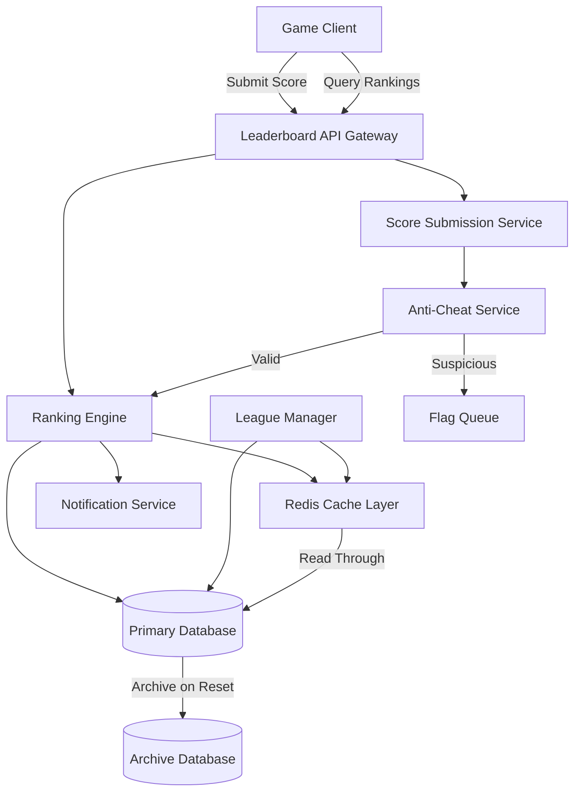

# Leaderboard System Design Document

## Overview

The Leaderboard System is a scalable, multi-tiered ranking mechanism designed to provide meaningful competition across various player segments. The system prioritizes performance, fairness, and psychological engagement by offering multiple leaderboard contexts (Global, Regional, Friends, Clan, Event) and implementing a league-based matchmaking system to ensure players compete against similarly skilled opponents.

The design emphasizes server-side validation to prevent cheating, efficient caching strategies to handle high read volumes, and flexible configuration to support various game modes and events.

## Architecture

### High-Level Architecture



### System Components

1. **Leaderboard API Gateway**: Entry point for all client requests, handles authentication and rate limiting
2. **Score Submission Service**: Processes incoming score submissions and coordinates with anti-cheat
3. **Ranking Engine**: Core component that calculates and maintains player rankings across all leaderboard types
4. **League Manager**: Manages league assignments, promotions, and demotions on weekly cycles
5. **Cache Layer**: Redis-based caching for high-performance read operations
6. **Anti-Cheat Service**: Validates score submissions against statistical models and game rules
7. **Notification Service**: Sends push notifications for rank changes and achievements
8. **Archive Database**: Stores historical leaderboard data for past cycles

### Data Flow

#### Score Submission Flow
1. Client submits score with game session metadata
2. API Gateway authenticates and validates request format
3. Score Submission Service receives the score
4. Anti-Cheat Service validates score against session data and statistical thresholds
5. If valid, Ranking Engine updates player's score in database
6. Cache is invalidated for affected leaderboard segments
7. Notification Service checks if rank change triggers notification thresholds
8. Client receives confirmation with updated rank

#### Leaderboard Query Flow
1. Client requests leaderboard data (type, page, player context)
2. API Gateway routes to Ranking Engine
3. Ranking Engine checks cache for requested data
4. If cache miss, query database and populate cache
5. Return leaderboard data with player's position highlighted
6. Client renders leaderboard UI

### Technology Stack

**Client Side (Unity)**:
- Unity UI System for leaderboard display
- REST API client for leaderboard queries and score submission
- Local caching for offline support and performance
- Unity Addressables for avatar and emblem assets
- DOTween for UI animations and transitions

**Server Side (Node.js/TypeScript)**:
- Express.js REST API
- Redis for caching and session management
- PostgreSQL for persistent storage
- Node-cron for scheduled jobs (league transitions, resets)
- Bull Queue for background job processing

## Components and Interfaces

### 1. Unity Client Components

#### LeaderboardManager (Unity Client)

```csharp
public class LeaderboardManager : MonoBehaviour
{
    // Singleton instance
    public static LeaderboardManager Instance { get; private set; }
    
    // Events
    public event Action<LeaderboardData> OnLeaderboardLoaded;
    public event Action<PlayerRank> OnPlayerRankUpdated;
    public event Action<ScoreSubmissionResult> OnScoreSubmitted;
    public event Action<LeagueInfo> OnLeagueInfoUpdated;
    public event Action<string> OnError;
    
    // Configuration
    [SerializeField] private LeaderboardConfig config;
    
    // Public Methods
    public void Initialize(string playerId);
    public Task<LeaderboardData> GetLeaderboard(LeaderboardType type, int page = 1);
    public Task<LeaderboardData> GetLeaderboardAroundPlayer(LeaderboardType type);
    public Task<PlayerRank> GetPlayerRank(LeaderboardType type);
    public Task<ScoreSubmissionResult> SubmitScore(int score, string gameMode, Dictionary<string, object> metadata);
    public Task<LeagueInfo> GetPlayerLeague();
    public Task<LeaderboardData> GetLeagueLeaderboard();
    public Task<LeaderboardData> GetEventLeaderboard(string eventId);
    public Task<List<LeaderboardData>> GetArchivedLeaderboard(LeaderboardType type, string cycle);
    public void ClearCache();
}
```

#### LeaderboardUIManager

```csharp
public class LeaderboardUIManager : MonoBehaviour
{
    // UI References
    [SerializeField] private LeaderboardWindow leaderboardWindow;
    [SerializeField] private LeaderboardTypeSelector typeSelector;
    [SerializeField] private LeaderboardEntryPool entryPool;
    [SerializeField] private PlayerRankDisplay playerRankDisplay;
    [SerializeField] private LeagueInfoPanel leagueInfoPanel;
    [SerializeField] private RefreshCycleTimer cycleTimer;
    [SerializeField] private RewardTierDisplay rewardDisplay;
    [SerializeField] private ScrollRect scrollRect;
    
    // Events
    public event Action<string> OnPlayerProfileRequested;
    public event Action OnRefreshRequested;
    
    // Public Methods
    public void ShowLeaderboard(LeaderboardType type = LeaderboardType.Global);
    public void HideLeaderboard();
    public void DisplayLeaderboardData(LeaderboardData data);
    public void HighlightPlayerEntry(LeaderboardEntry playerEntry);
    public void ShowLeagueInfo(LeagueInfo info);
    public void UpdateRefreshTimer(TimeSpan timeRemaining);
    public void ShowRewardTiers(List<RewardTier> rewards);
    public void ScrollToPlayerPosition();
    public void ShowLoadingState();
    public void ShowErrorState(string message);
}
```

#### LeaderboardEntry (UI Component)

```csharp
public class LeaderboardEntry : MonoBehaviour
{
    [SerializeField] private TextMeshProUGUI rankText;
    [SerializeField] private Image avatarImage;
    [SerializeField] private TextMeshProUGUI playerNameText;
    [SerializeField] private TextMeshProUGUI scoreText;
    [SerializeField] private Image highlightBackground;
    [SerializeField] private GameObject topRankBadge;
    [SerializeField] private Image clanEmblem;
    [SerializeField] private Button profileButton;
    
    private string playerId;
    
    public void Setup(LeaderboardEntryData data, bool isCurrentPlayer)
    {
        rankText.text = data.rank.ToString();
        playerNameText.text = data.playerName;
        scoreText.text = FormatScore(data.score);
        
        // Load avatar
        StartCoroutine(LoadAvatar(data.avatarUrl));
        
        // Highlight if current player
        highlightBackground.gameObject.SetActive(isCurrentPlayer);
        
        // Show top rank badge for top 3
        topRankBadge.SetActive(data.rank <= 3);
        
        // Show clan emblem if available
        if (!string.IsNullOrEmpty(data.clanEmblemUrl))
        {
            StartCoroutine(LoadClanEmblem(data.clanEmblemUrl));
        }
        
        playerId = data.playerId;
        profileButton.onClick.AddListener(() => OnProfileButtonClicked());
    }
    
    private void OnProfileButtonClicked()
    {
        // Request to view player profile
        LeaderboardUIManager.Instance.OnPlayerProfileRequested?.Invoke(playerId);
    }
    
    private string FormatScore(long score)
    {
        if (score >= 1000000)
            return $"{score / 1000000f:F1}M";
        if (score >= 1000)
            return $"{score / 1000f:F1}K";
        return score.ToString();
    }
}
```

#### LeaderboardAPIClient

```csharp
public class LeaderboardAPIClient
{
    private readonly string baseUrl;
    private readonly string authToken;
    private readonly LeaderboardCache cache;
    
    public LeaderboardAPIClient(string baseUrl, string authToken)
    {
        this.baseUrl = baseUrl;
        this.authToken = authToken;
        this.cache = new LeaderboardCache();
    }
    
    public async Task<LeaderboardData> GetLeaderboard(LeaderboardType type, int page, bool useCache = true)
    {
        string cacheKey = $"leaderboard_{type}_{page}";
        
        if (useCache && cache.TryGet(cacheKey, out LeaderboardData cachedData))
        {
            return cachedData;
        }
        
        string url = $"{baseUrl}/leaderboards/{type}?page={page}";
        
        using (UnityWebRequest request = UnityWebRequest.Get(url))
        {
            request.SetRequestHeader("Authorization", $"Bearer {authToken}");
            
            await request.SendWebRequest();
            
            if (request.result == UnityWebRequest.Result.Success)
            {
                LeaderboardData data = JsonUtility.FromJson<LeaderboardData>(request.downloadHandler.text);
                cache.Set(cacheKey, data, TimeSpan.FromMinutes(1));
                return data;
            }
            else
            {
                throw new Exception($"Failed to fetch leaderboard: {request.error}");
            }
        }
    }
    
    public async Task<PlayerRank> GetPlayerRank(string playerId, LeaderboardType type)
    {
        string url = $"{baseUrl}/leaderboards/{type}/player/{playerId}";
        
        using (UnityWebRequest request = UnityWebRequest.Get(url))
        {
            request.SetRequestHeader("Authorization", $"Bearer {authToken}");
            
            await request.SendWebRequest();
            
            if (request.result == UnityWebRequest.Result.Success)
            {
                return JsonUtility.FromJson<PlayerRank>(request.downloadHandler.text);
            }
            else
            {
                throw new Exception($"Failed to fetch player rank: {request.error}");
            }
        }
    }
    
    public async Task<ScoreSubmissionResult> SubmitScore(ScoreSubmission submission)
    {
        string url = $"{baseUrl}/scores";
        string jsonData = JsonUtility.ToJson(submission);
        
        using (UnityWebRequest request = new UnityWebRequest(url, "POST"))
        {
            byte[] bodyRaw = System.Text.Encoding.UTF8.GetBytes(jsonData);
            request.uploadHandler = new UploadHandlerRaw(bodyRaw);
            request.downloadHandler = new DownloadHandlerBuffer();
            request.SetRequestHeader("Content-Type", "application/json");
            request.SetRequestHeader("Authorization", $"Bearer {authToken}");
            
            await request.SendWebRequest();
            
            if (request.result == UnityWebRequest.Result.Success)
            {
                // Invalidate cache after score submission
                cache.InvalidateAll();
                return JsonUtility.FromJson<ScoreSubmissionResult>(request.downloadHandler.text);
            }
            else
            {
                throw new Exception($"Failed to submit score: {request.error}");
            }
        }
    }
}
```

#### LeaderboardCache

```csharp
public class LeaderboardCache
{
    private Dictionary<string, CacheEntry> cache = new Dictionary<string, CacheEntry>();
    
    private class CacheEntry
    {
        public object Data;
        public DateTime ExpiresAt;
    }
    
    public void Set(string key, object data, TimeSpan ttl)
    {
        cache[key] = new CacheEntry
        {
            Data = data,
            ExpiresAt = DateTime.UtcNow.Add(ttl)
        };
    }
    
    public bool TryGet<T>(string key, out T data)
    {
        if (cache.TryGetValue(key, out CacheEntry entry))
        {
            if (DateTime.UtcNow < entry.ExpiresAt)
            {
                data = (T)entry.Data;
                return true;
            }
            else
            {
                cache.Remove(key);
            }
        }
        
        data = default;
        return false;
    }
    
    public void InvalidateAll()
    {
        cache.Clear();
    }
    
    public void InvalidateByPrefix(string prefix)
    {
        var keysToRemove = cache.Keys.Where(k => k.StartsWith(prefix)).ToList();
        foreach (var key in keysToRemove)
        {
            cache.Remove(key);
        }
    }
}
```

#### LeaderboardConfig (ScriptableObject)

```csharp
[CreateAssetMenu(fileName = "LeaderboardConfig", menuName = "Game/Leaderboard Config")]
public class LeaderboardConfig : ScriptableObject
{
    [Header("API Configuration")]
    public string apiBaseUrl = "https://api.yourgame.com";
    
    [Header("Cache Settings")]
    public int cacheExpirationMinutes = 1;
    public bool enableOfflineMode = true;
    
    [Header("UI Settings")]
    public int entriesPerPage = 50;
    public float scrollSpeed = 1000f;
    public bool autoScrollToPlayer = true;
    
    [Header("Refresh Settings")]
    public bool autoRefreshEnabled = true;
    public float autoRefreshIntervalSeconds = 30f;
    
    [Header("Animation Settings")]
    public float entryAnimationDuration = 0.3f;
    public Ease entryAnimationEase = Ease.OutQuad;
}
```

#### Data Models (Unity)

```csharp
[System.Serializable]
public class LeaderboardData
{
    public LeaderboardType type;
    public List<LeaderboardEntryData> entries;
    public LeaderboardEntryData playerEntry;
    public int totalPlayers;
    public RefreshInfo refreshInfo;
    public List<RewardTier> rewards;
}

[System.Serializable]
public class LeaderboardEntryData
{
    public int rank;
    public string playerId;
    public string playerName;
    public string avatarUrl;
    public long score;
    public string clanName;
    public string clanEmblemUrl;
    public int level;
}

[System.Serializable]
public class PlayerRank
{
    public int rank;
    public long score;
    public LeaderboardType type;
    public List<LeaderboardEntryData> nearbyPlayers;
}

[System.Serializable]
public class ScoreSubmission
{
    public string playerId;
    public long score;
    public string gameMode;
    public string sessionId;
    public long timestamp;
    public Dictionary<string, object> gameplayMetrics;
}

[System.Serializable]
public class ScoreSubmissionResult
{
    public bool success;
    public int newRank;
    public int previousRank;
    public bool isNewPersonalBest;
    public string message;
}

[System.Serializable]
public class LeagueInfo
{
    public string leagueId;
    public LeagueTier tier;
    public int currentRank;
    public int promotionThreshold;
    public int demotionThreshold;
    public TimeSpan timeUntilTransition;
}

[System.Serializable]
public class LeagueTier
{
    public string id;
    public string name;
    public int level;
    public string iconUrl;
}

[System.Serializable]
public class RefreshInfo
{
    public string currentCycle;
    public long nextResetTimestamp;
    public string refreshType; // daily, weekly, monthly, seasonal
}

[System.Serializable]
public class RewardTier
{
    public int minRank;
    public int maxRank;
    public List<RewardItem> rewards;
}

[System.Serializable]
public class RewardItem
{
    public string itemId;
    public string itemName;
    public int quantity;
    public string iconUrl;
}

public enum LeaderboardType
{
    Global,
    Regional,
    Friends,
    Clan,
    Event,
    League
}
```

### 2. Server Components (Node.js/TypeScript)

#### LeaderboardManager (Server)
Primary interface for all leaderboard operations.

```typescript
interface LeaderboardManager {
  // Query operations
  getLeaderboard(type: LeaderboardType, options: QueryOptions): Promise<LeaderboardData>;
  getPlayerRank(playerId: string, type: LeaderboardType): Promise<PlayerRank>;
  getPlayerContext(playerId: string, type: LeaderboardType): Promise<PlayerContext>;
  
  // Score operations
  submitScore(submission: ScoreSubmission): Promise<SubmissionResult>;
  
  // League operations
  getPlayerLeague(playerId: string): Promise<LeagueInfo>;
  getLeagueLeaderboard(leagueId: string): Promise<LeaderboardData>;
  
  // Event operations
  createEventLeaderboard(config: EventConfig): Promise<string>;
  endEventLeaderboard(eventId: string): Promise<void>;
}

interface QueryOptions {
  page?: number;
  pageSize?: number;
  aroundPlayer?: boolean; // Show players around the querying player
  refreshCycle?: string; // Specific cycle to query (current, previous, etc.)
}

interface LeaderboardData {
  type: LeaderboardType;
  entries: LeaderboardEntry[];
  playerEntry?: LeaderboardEntry; // Highlighted player's entry
  totalPlayers: number;
  refreshInfo: RefreshInfo;
  rewards?: RewardTier[];
}

interface LeaderboardEntry {
  rank: number;
  playerId: string;
  playerName: string;
  avatarUrl: string;
  score: number;
  metadata?: Record<string, any>; // Additional display data (level, clan, etc.)
}
```

#### 2. ScoreValidator
Handles anti-cheat validation logic.

```typescript
interface ScoreValidator {
  validateScore(submission: ScoreSubmission): Promise<ValidationResult>;
  flagSuspiciousScore(submission: ScoreSubmission, reason: string): Promise<void>;
  reviewFlaggedScore(submissionId: string, decision: ReviewDecision): Promise<void>;
}

interface ScoreSubmission {
  playerId: string;
  score: number;
  gameMode: string;
  sessionId: string;
  timestamp: number;
  deviceInfo: DeviceInfo;
  gameplayMetrics: GameplayMetrics; // Time played, actions taken, etc.
}

interface ValidationResult {
  isValid: boolean;
  confidence: number; // 0-1 confidence score
  flags: ValidationFlag[];
  requiresReview: boolean;
}

interface ValidationFlag {
  type: 'STATISTICAL_ANOMALY' | 'IMPOSSIBLE_TIME' | 'SUSPICIOUS_PATTERN' | 'DEVICE_MISMATCH';
  severity: 'LOW' | 'MEDIUM' | 'HIGH';
  details: string;
}
```

#### 3. LeagueManager
Manages league assignments and transitions.

```typescript
interface LeagueManager {
  assignPlayerToLeague(playerId: string): Promise<LeagueAssignment>;
  processWeeklyTransitions(): Promise<TransitionReport>;
  getLeagueStandings(leagueId: string): Promise<LeaderboardData>;
  getLeagueTier(playerId: string): Promise<LeagueTier>;
}

interface LeagueAssignment {
  leagueId: string;
  tier: LeagueTier;
  bracketSize: number;
  joinedAt: number;
}

interface LeagueTier {
  id: string;
  name: string; // Bronze, Silver, Gold, Platinum, Diamond, Master
  level: number; // 1-6
  promotionThreshold: number; // Top N players promoted
  demotionThreshold: number; // Bottom N players demoted
}

interface TransitionReport {
  processedPlayers: number;
  promotions: number;
  demotions: number;
  maintained: number;
  errors: TransitionError[];
}
```

#### 4. CacheManager
Optimizes read performance through intelligent caching.

```typescript
interface CacheManager {
  getLeaderboardCache(key: string): Promise<LeaderboardData | null>;
  setLeaderboardCache(key: string, data: LeaderboardData, ttl: number): Promise<void>;
  invalidateLeaderboardCache(type: LeaderboardType, scope?: string): Promise<void>;
  invalidatePlayerCache(playerId: string): Promise<void>;
}

// Cache key patterns
// leaderboard:{type}:{scope}:{page} - e.g., "leaderboard:global:all:1"
// leaderboard:friends:{playerId}:{page}
// leaderboard:league:{leagueId}:{page}
// player:rank:{playerId}:{type}
```

## Data Models

## Database Architecture

### Technology Stack

**Primary Database**: PostgreSQL 14+
- ACID transactions for score submissions
- Complex queries for analytics and anti-cheat
- Efficient archiving of historical leaderboards
- Strong data integrity for competitive features

**Cache Layer**: Redis 7+
- Sorted sets for real-time rankings (O(log N) operations)
- Extremely fast leaderboard queries
- Memory-efficient for millions of players
- TTL support for cache invalidation

**Connection Pooling**: PgBouncer

### Database Schema (PostgreSQL)

```sql
-- Leaderboard schema
CREATE SCHEMA IF NOT EXISTS leaderboard;

#### Players Table
CREATE TABLE leaderboard.players (
  player_id VARCHAR(36) PRIMARY KEY,
  player_name VARCHAR(50) NOT NULL,
  avatar_url VARCHAR(255),
  region VARCHAR(10),
  created_at TIMESTAMP DEFAULT CURRENT_TIMESTAMP,
  last_active TIMESTAMP DEFAULT CURRENT_TIMESTAMP,
  INDEX idx_region (region),
  INDEX idx_last_active (last_active DESC)
);
```

#### Leaderboard Scores Table
CREATE TABLE leaderboard.scores (
  score_id VARCHAR(36) PRIMARY KEY,
  player_id VARCHAR(36) NOT NULL REFERENCES leaderboard.players(player_id),
  leaderboard_type VARCHAR(20) NOT NULL,
  scope VARCHAR(50), -- Region code, event ID, league ID, etc.
  score BIGINT NOT NULL,
  refresh_cycle VARCHAR(20) NOT NULL, -- e.g., "2025-W43", "2025-10", "permanent"
  submitted_at TIMESTAMP DEFAULT CURRENT_TIMESTAMP,
  metadata JSONB,
  
  INDEX idx_leaderboard_lookup (leaderboard_type, scope, refresh_cycle, score DESC),
  INDEX idx_player_scores (player_id, leaderboard_type, refresh_cycle),
  INDEX idx_score_submission (submitted_at DESC),
  CHECK (leaderboard_type IN ('global', 'regional', 'friends', 'clan', 'event', 'league'))
);

-- Partitioning strategy: Partition by refresh_cycle for efficient archiving
-- CREATE TABLE leaderboard.scores_2025_w43 PARTITION OF leaderboard.scores
-- FOR VALUES IN ('2025-W43');
```

#### Leagues Table
CREATE TABLE leaderboard.leagues (
  league_id VARCHAR(36) PRIMARY KEY,
  tier_id VARCHAR(20) NOT NULL,
  tier_level INT NOT NULL,
  season VARCHAR(20) NOT NULL, -- e.g., "2025-W43"
  bracket_size INT DEFAULT 50,
  created_at TIMESTAMP DEFAULT CURRENT_TIMESTAMP,
  
  INDEX idx_season (season),
  INDEX idx_tier (tier_id, season),
  CHECK (tier_id IN ('bronze', 'silver', 'gold', 'platinum', 'diamond', 'master'))
);
```

#### League Memberships Table
CREATE TABLE leaderboard.league_memberships (
  membership_id VARCHAR(36) PRIMARY KEY,
  player_id VARCHAR(36) NOT NULL REFERENCES leaderboard.players(player_id),
  league_id VARCHAR(36) NOT NULL REFERENCES leaderboard.leagues(league_id),
  weekly_score BIGINT DEFAULT 0,
  final_rank INT,
  joined_at TIMESTAMP DEFAULT CURRENT_TIMESTAMP,
  status VARCHAR(20) DEFAULT 'active',
  
  INDEX idx_player_league (player_id, league_id),
  INDEX idx_league_members (league_id, status),
  INDEX idx_league_rankings (league_id, weekly_score DESC),
  CHECK (status IN ('active', 'promoted', 'demoted', 'maintained'))
);
```

#### Score Submissions Table (Anti-Cheat)
CREATE TABLE leaderboard.score_submissions (
  submission_id VARCHAR(36) PRIMARY KEY,
  player_id VARCHAR(36) NOT NULL REFERENCES leaderboard.players(player_id),
  score BIGINT NOT NULL,
  game_mode VARCHAR(50) NOT NULL,
  session_id VARCHAR(36) NOT NULL,
  submitted_at TIMESTAMP DEFAULT CURRENT_TIMESTAMP,
  device_info JSONB,
  gameplay_metrics JSONB,
  validation_status VARCHAR(20) DEFAULT 'pending',
  validation_flags JSONB,
  reviewed_by VARCHAR(36),
  reviewed_at TIMESTAMP,
  
  INDEX idx_player_submissions (player_id, submitted_at DESC),
  INDEX idx_flagged (validation_status, submitted_at) WHERE validation_status IN ('flagged', 'pending'),
  INDEX idx_session (session_id),
  CHECK (validation_status IN ('pending', 'approved', 'flagged', 'rejected'))
);
```

#### Archived Leaderboards Table
CREATE TABLE leaderboard.archives (
  archive_id VARCHAR(36) PRIMARY KEY,
  leaderboard_type VARCHAR(20) NOT NULL,
  scope VARCHAR(50),
  refresh_cycle VARCHAR(20) NOT NULL,
  archived_at TIMESTAMP DEFAULT CURRENT_TIMESTAMP,
  rankings JSONB NOT NULL, -- Top 100 or relevant subset
  total_participants INT,
  
  INDEX idx_archive_lookup (leaderboard_type, scope, refresh_cycle),
  INDEX idx_archived_at (archived_at DESC),
  CHECK (leaderboard_type IN ('global', 'regional', 'friends', 'clan', 'event', 'league'))
);
```

#### Event Leaderboards Table
CREATE TABLE leaderboard.event_leaderboards (
  event_id VARCHAR(50) PRIMARY KEY,
  event_name VARCHAR(200) NOT NULL,
  start_time TIMESTAMP NOT NULL,
  end_time TIMESTAMP NOT NULL,
  rewards JSONB NOT NULL,
  status VARCHAR(20) DEFAULT 'active',
  created_at TIMESTAMP DEFAULT CURRENT_TIMESTAMP,
  
  INDEX idx_event_time (start_time, end_time),
  INDEX idx_active_events (status, start_time) WHERE status = 'active',
  CHECK (status IN ('active', 'completed', 'rewards_distributed'))
);

#### Anti-Cheat Flags Table
CREATE TABLE leaderboard.cheat_flags (
  flag_id VARCHAR(36) PRIMARY KEY,
  player_id VARCHAR(36) NOT NULL REFERENCES leaderboard.players(player_id),
  submission_id VARCHAR(36) REFERENCES leaderboard.score_submissions(submission_id),
  reason VARCHAR(200) NOT NULL,
  score_value BIGINT,
  flagged_at TIMESTAMP DEFAULT CURRENT_TIMESTAMP,
  reviewed BOOLEAN DEFAULT FALSE,
  action_taken VARCHAR(100),
  reviewed_by VARCHAR(36),
  reviewed_at TIMESTAMP,
  
  INDEX idx_player_flags (player_id, flagged_at DESC),
  INDEX idx_pending_review (reviewed, flagged_at) WHERE reviewed = FALSE
);
```

### Redis Data Structures

```
# Redis Sorted Sets for real-time rankings
# Key patterns:

# Global leaderboard
lb:global:{refresh_cycle} -> Sorted Set (score -> player_id)

# Regional leaderboard
lb:regional:{region}:{refresh_cycle} -> Sorted Set

# Friends leaderboard (per player)
lb:friends:{player_id}:{refresh_cycle} -> Sorted Set

# Clan leaderboard
lb:clan:{clan_id}:{refresh_cycle} -> Sorted Set (member scores)
lb:clan:total:{refresh_cycle} -> Sorted Set (clan total scores)

# Event leaderboard
lb:event:{event_id} -> Sorted Set

# League leaderboard
lb:league:{league_id} -> Sorted Set

# Cache TTLs:
# - Global/Regional: 10 minutes
# - Friends: 5 minutes
# - Clan: 5 minutes
# - League: 1 minute (during active play)
# - Event: 30 seconds (high competition)

# Player rank cache
lb:rank:{player_id}:{type}:{scope} -> JSON (TTL: 1 minute)
```

### Materialized Views for Performance

```sql
-- Global leaderboard materialized view (top 1000)
CREATE MATERIALIZED VIEW leaderboard.global_top_1000 AS
SELECT 
  player_id,
  score,
  RANK() OVER (ORDER BY score DESC, submitted_at ASC) as rank
FROM leaderboard.scores
WHERE leaderboard_type = 'global'
  AND refresh_cycle = (SELECT MAX(refresh_cycle) FROM leaderboard.scores WHERE leaderboard_type = 'global')
ORDER BY rank
LIMIT 1000;

CREATE UNIQUE INDEX ON leaderboard.global_top_1000 (rank);
CREATE INDEX ON leaderboard.global_top_1000 (player_id);

-- Refresh every 5 minutes
REFRESH MATERIALIZED VIEW CONCURRENTLY leaderboard.global_top_1000;

-- Clan leaderboard materialized view
CREATE MATERIALIZED VIEW leaderboard.clan_rankings AS
SELECT 
  c.clan_id,
  c.clan_name,
  SUM(s.score) as total_score,
  COUNT(DISTINCT cm.player_id) as member_count,
  RANK() OVER (ORDER BY SUM(s.score) DESC) as rank
FROM clan.clans c
JOIN clan.members cm ON c.clan_id = cm.clan_id
JOIN leaderboard.scores s ON cm.player_id = s.player_id
WHERE s.leaderboard_type = 'global'
  AND s.refresh_cycle = (SELECT MAX(refresh_cycle) FROM leaderboard.scores WHERE leaderboard_type = 'global')
GROUP BY c.clan_id, c.clan_name
ORDER BY rank;

CREATE UNIQUE INDEX ON leaderboard.clan_rankings (clan_id);
CREATE INDEX ON leaderboard.clan_rankings (rank);

-- Refresh every 5 minutes
REFRESH MATERIALIZED VIEW CONCURRENTLY leaderboard.clan_rankings;
```

### Ranking Calculation

#### Global/Regional Leaderboards
Rankings are calculated using a simple descending score sort with tie-breaking by earliest submission time.

```sql
-- Get global leaderboard with ranks
SELECT 
  player_id,
  score,
  RANK() OVER (ORDER BY score DESC, submitted_at ASC) as rank
FROM leaderboard_scores
WHERE leaderboard_type = 'GLOBAL'
  AND refresh_cycle = '2025-W43'
ORDER BY rank
LIMIT 100;
```

#### Friends Leaderboard
Requires joining with friendships table to filter to connected players.

```sql
-- Get friends leaderboard for a specific player
SELECT 
  ls.player_id,
  ls.score,
  RANK() OVER (ORDER BY ls.score DESC, ls.submitted_at ASC) as rank
FROM leaderboard_scores ls
WHERE ls.leaderboard_type = 'GLOBAL'
  AND ls.refresh_cycle = '2025-W43'
  AND ls.player_id IN (
    SELECT friend_id FROM friendships 
    WHERE player_id = ? AND status = 'ACCEPTED'
    UNION
    SELECT ? -- Include the player themselves
  )
ORDER BY rank;
```

#### Clan Leaderboard
Aggregates scores from all clan members.

```sql
-- Get clan leaderboard
SELECT 
  c.clan_id,
  c.clan_name,
  c.emblem_url,
  SUM(ls.score) as total_score,
  COUNT(DISTINCT cm.player_id) as member_count,
  RANK() OVER (ORDER BY SUM(ls.score) DESC) as rank
FROM clans c
JOIN clan_memberships cm ON c.clan_id = cm.clan_id
JOIN leaderboard_scores ls ON cm.player_id = ls.player_id
WHERE ls.leaderboard_type = 'GLOBAL'
  AND ls.refresh_cycle = '2025-W43'
GROUP BY c.clan_id
ORDER BY rank
LIMIT 100;
```

## Error Handling

### Error Categories

1. **Validation Errors**: Invalid input data, malformed requests
2. **Authentication Errors**: Invalid player credentials, expired tokens
3. **Rate Limiting Errors**: Too many requests from a single player
4. **Anti-Cheat Errors**: Suspicious score submissions
5. **System Errors**: Database failures, cache unavailability, service timeouts

### Error Response Format

```typescript
interface ErrorResponse {
  error: {
    code: string;
    message: string;
    details?: Record<string, any>;
    retryable: boolean;
  };
}

// Example error codes
enum ErrorCode {
  INVALID_SCORE = 'INVALID_SCORE',
  SCORE_TOO_HIGH = 'SCORE_TOO_HIGH',
  SUSPICIOUS_SUBMISSION = 'SUSPICIOUS_SUBMISSION',
  RATE_LIMIT_EXCEEDED = 'RATE_LIMIT_EXCEEDED',
  LEADERBOARD_NOT_FOUND = 'LEADERBOARD_NOT_FOUND',
  PLAYER_NOT_FOUND = 'PLAYER_NOT_FOUND',
  DATABASE_ERROR = 'DATABASE_ERROR',
  CACHE_ERROR = 'CACHE_ERROR'
}
```

### Graceful Degradation

- **Cache Failure**: Fall back to direct database queries with increased latency
- **Database Read Failure**: Return cached data with staleness indicator
- **Anti-Cheat Service Down**: Queue submissions for later validation, allow provisional ranking
- **Notification Service Down**: Log notification events for retry, don't block score submission

### Retry Strategy

- **Score Submissions**: Client retries up to 3 times with exponential backoff
- **Leaderboard Queries**: Client retries once immediately, then shows cached data if available
- **Background Jobs** (league transitions, archiving): Automatic retry with exponential backoff up to 5 attempts

## Testing Strategy

### Unit Testing

**Components to Test**:
- ScoreValidator: Validation logic for various score patterns
- LeagueManager: Promotion/demotion calculations
- RankingEngine: Rank calculation algorithms
- CacheManager: Cache key generation and invalidation logic

**Test Coverage Goals**: 80% code coverage for core business logic

### Integration Testing

**Test Scenarios**:
1. End-to-end score submission flow with anti-cheat validation
2. Leaderboard query with cache hit and cache miss scenarios
3. League transition processing with promotions and demotions
4. Event leaderboard lifecycle (creation, active period, finalization)
5. Friends leaderboard with friendship changes
6. Clan leaderboard with member additions/removals

### Performance Testing

**Load Test Scenarios**:
1. **Peak Score Submission**: 10,000 concurrent score submissions
2. **Leaderboard Query Load**: 50,000 queries per minute
3. **League Transition**: Process 1 million players in under 10 minutes
4. **Cache Performance**: 95% cache hit rate under normal load

**Performance Targets**:
- Score submission processing: < 500ms (p95)
- Leaderboard query response: < 200ms (p95)
- Player rank lookup: < 100ms (p95)
- Cache response time: < 10ms (p95)

### Anti-Cheat Testing

**Test Cases**:
1. Submit scores that exceed theoretical maximum
2. Submit scores with impossible completion times
3. Submit multiple scores in rapid succession
4. Submit scores from different devices for same session
5. Submit scores with anomalous gameplay metrics

**Expected Behavior**: All suspicious submissions flagged for review, legitimate submissions approved

### User Acceptance Testing

**Test Scenarios**:
1. Player views global leaderboard and sees their position
2. Player switches between different leaderboard types
3. Player receives notification when overtaken by friend
4. Player gets promoted to higher league at week end
5. Player views archived leaderboard from previous cycle
6. Player participates in event leaderboard and receives rewards

## Performance Optimization

### Caching Strategy

**Cache Layers**:
1. **L1 - Client Cache**: Cache leaderboard data for 30 seconds
2. **L2 - CDN Cache**: Cache top 100 global leaderboard for 60 seconds
3. **L3 - Redis Cache**: Cache all leaderboard queries for 5 minutes

**Cache Invalidation**:
- Invalidate affected leaderboard segments when score is submitted
- Invalidate player-specific caches when rank changes significantly
- Invalidate league caches at end of weekly cycle

### Database Optimization

**Indexing Strategy**:
- Composite index on (leaderboard_type, scope, refresh_cycle, score DESC) for fast ranking queries
- Index on (player_id, leaderboard_type, refresh_cycle) for player rank lookups
- Partition leaderboard_scores table by refresh_cycle for efficient archiving

**Query Optimization**:
- Use materialized views for frequently accessed leaderboard segments (top 100 global)
- Implement read replicas for leaderboard queries to reduce load on primary database
- Use database connection pooling to handle high concurrent query load

### Scalability Considerations

**Horizontal Scaling**:
- Leaderboard API Gateway: Stateless, can scale horizontally behind load balancer
- Ranking Engine: Partition by leaderboard type for parallel processing
- Cache Layer: Redis cluster with sharding by leaderboard type

**Vertical Scaling**:
- Database: Increase resources during peak times (event endings, league transitions)
- Cache: Increase memory allocation for larger leaderboards

## Security Considerations

### Authentication & Authorization
- All API requests require valid player authentication token
- Rate limiting: 100 requests per minute per player for queries, 10 per minute for submissions
- Scope-based access control for admin operations (create events, review flagged scores)

### Data Privacy
- Player profiles respect privacy settings (public, friends-only, private)
- Leaderboard data anonymized for players with private profiles
- GDPR compliance: Player data deletion includes all leaderboard history

### Anti-Cheat Measures
- Server-side score validation (never trust client)
- Statistical anomaly detection using historical player performance
- Device fingerprinting to detect account sharing
- Session validation to ensure score matches gameplay session
- Manual review queue for high-value event leaderboards

## Integration Points

### Friend System Integration
- Friends leaderboard queries friendship data
- Notifications sent when friends surpass player's score
- Friend profile viewing from leaderboard entries

### Clan System Integration
- Clan leaderboard aggregates member scores
- Clan profile viewing from clan leaderboard
- Clan-based rewards for top-ranking clans

### Notification System Integration
- Rank change notifications
- League promotion/demotion notifications
- Event leaderboard reminders
- Friend competition notifications

### Reward System Integration
- Automatic reward distribution based on final rankings
- Reward tier display on leaderboard UI
- Reward claim tracking and history

## Deployment Strategy

### Phased Rollout

**Phase 1: Core Leaderboards** (Week 1-2)
- Implement Global and Regional leaderboards
- Basic score submission and ranking
- Simple caching layer

**Phase 2: Social Features** (Week 3-4)
- Friends leaderboard
- Clan leaderboard
- Player profile viewing

**Phase 3: League System** (Week 5-6)
- League assignment and matchmaking
- Weekly promotion/demotion cycles
- League-specific leaderboards

**Phase 4: Events & Advanced Features** (Week 7-8)
- Event leaderboard creation and management
- Advanced anti-cheat with manual review
- Notification system integration
- Reward distribution

### Monitoring & Metrics

**Key Metrics**:
- Leaderboard query latency (p50, p95, p99)
- Score submission success rate
- Cache hit rate
- Anti-cheat flag rate and false positive rate
- Daily/weekly active leaderboard viewers
- League transition success rate

**Alerts**:
- Leaderboard query latency > 500ms
- Score submission failure rate > 5%
- Cache hit rate < 80%
- Anti-cheat service unavailable
- Database connection pool exhausted

## Future Enhancements

1. **Cross-Platform Leaderboards**: Separate leaderboards for mobile vs. PC players
2. **Skill-Based Matchmaking**: Use leaderboard data to improve matchmaking
3. **Replay System**: Top players can share gameplay replays
4. **Spectator Mode**: Watch top-ranked players in real-time
5. **Seasonal Themes**: Visual themes for leaderboards based on game seasons
6. **Predictive Analytics**: ML models to predict player rank trajectories
7. **Social Sharing**: Share leaderboard achievements to social media
8. **Bracket Tournaments**: Use leaderboard rankings to seed tournament brackets
