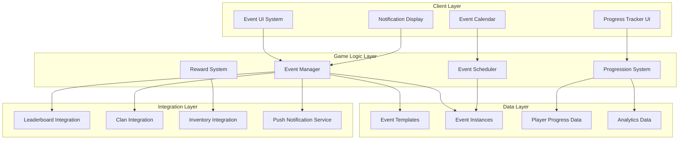
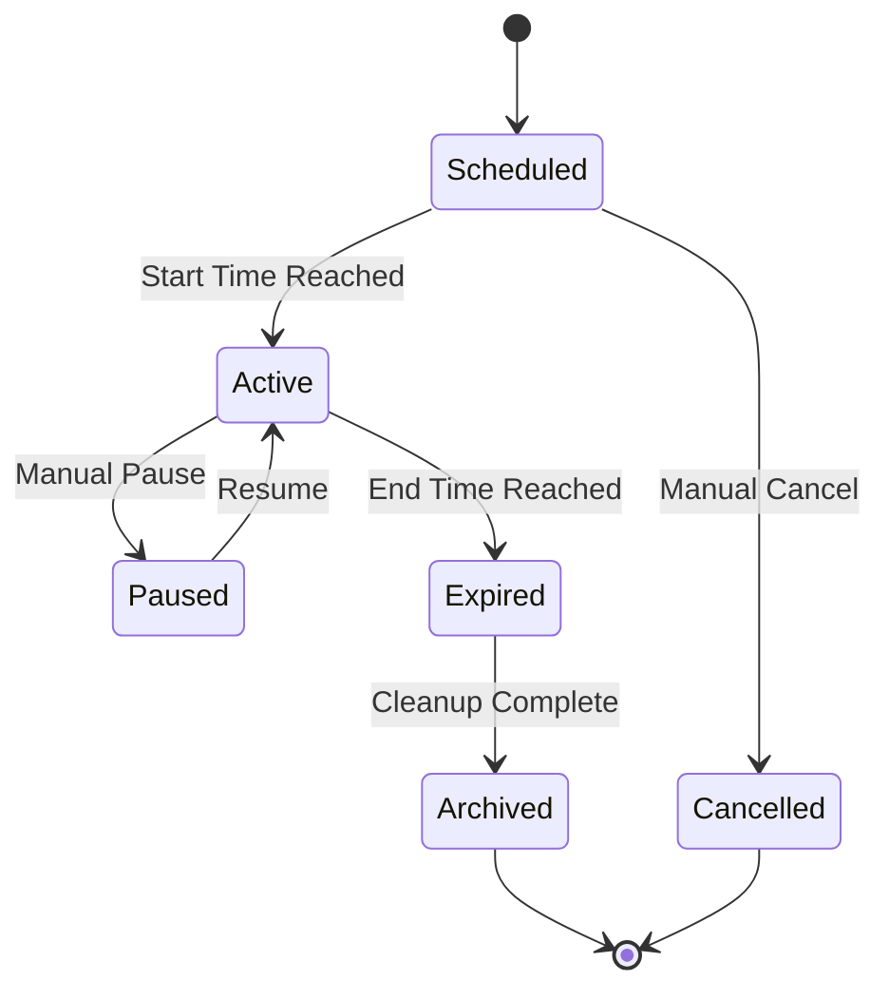

# Live Events System - Design Document

## Overview

The Live Events System is a comprehensive framework for managing time-limited in-game activities that drive player engagement and monetization. The system architecture follows a modular design with clear separation between event management, player progression, notification delivery, and reward distribution. The design emphasizes scalability to support multiple concurrent events, flexibility for diverse event types, and integration with existing game systems (leaderboards, clans, inventory).

### Core Design Principles

1. **Modularity**: Each subsystem (scheduling, progression, notifications, rewards) operates independently with well-defined interfaces
2. **Scalability**: Support for unlimited concurrent events with performance optimization through caching and async processing
3. **Flexibility**: Template-based event creation allowing rapid deployment of new content with minimal development overhead
4. **Data-Driven**: Event configuration stored as data assets enabling non-programmer content creation
5. **Player-Centric**: Intelligent scheduling and personalization to maximize engagement while preventing fatigue

## Architecture

### High-Level System Architecture



### Component Architecture

The system consists of six primary components:

**1. Event Manager**: Central orchestrator managing event lifecycle (creation, activation, deactivation, expiration)

**2. Event Scheduler**: Handles event timing, conflict detection, and intelligent spacing to prevent fatigue

**3. Progression System**: Tracks player progress toward objectives, manages milestones, and triggers rewards

**4. Notification Service**: Delivers multi-channel notifications (in-game popups, banners, push notifications)

**5. Reward Distribution System**: Validates eligibility, distributes rewards, and handles expiration edge cases

**6. Analytics Engine**: Collects performance metrics, generates reports, and feeds personalization algorithms

## Components and Interfaces

### Event Manager

**Responsibilities:**
- Event lifecycle management (initialize, activate, update, deactivate, expire)
- Event state machine transitions
- Template instantiation and customization
- Integration coordination with other game systems

**Key Interfaces:**

```csharp
public interface IEventManager
{
    // Event lifecycle
    EventInstance CreateEventFromTemplate(string templateId, EventConfig config);
    void ActivateEvent(string eventId);
    void DeactivateEvent(string eventId);
    void UpdateActiveEvents(float deltaTime);
    
    // Event queries
    List<EventInstance> GetActiveEvents();
    List<EventInstance> GetUpcomingEvents(TimeSpan lookAhead);
    EventInstance GetEventById(string eventId);
    
    // Player interaction
    void RegisterPlayerParticipation(string playerId, string eventId);
    bool IsPlayerEligible(string playerId, string eventId);
}
```

**State Machine:**



### Event Scheduler

**Responsibilities:**
- Event timing and countdown management
- Conflict detection and resolution
- Fatigue prevention through intelligent spacing
- Calendar generation and filtering

**Key Interfaces:**

```csharp
public interface IEventScheduler
{
    // Scheduling
    bool ScheduleEvent(EventInstance eventInstance);
    bool ValidateSchedule(EventInstance eventInstance);
    List<ScheduleConflict> DetectConflicts(EventInstance eventInstance);
    
    // Calendar
    EventCalendar GenerateCalendar(DateTime startDate, DateTime endDate);
    List<EventInstance> FilterEvents(EventFilter filter);
    
    // Timing
    TimeSpan GetTimeUntilStart(string eventId);
    TimeSpan GetTimeRemaining(string eventId);
}
```

**Scheduling Rules:**
- Maximum 4 concurrent events across all types
- Maximum 2 concurrent events of the same type
- Minimum 48-hour gap between major events
- Mini-events and daily activities exempt from concurrent limits

### Progression System

**Responsibilities:**
- Track player progress toward event objectives
- Calculate completion percentages and milestone achievements
- Persist progress data with server synchronization
- Trigger reward unlocks at milestones

**Key Interfaces:**

```csharp
public interface IProgressionSystem
{
    // Progress tracking
    void RecordProgress(string playerId, string eventId, string objectiveId, float amount);
    EventProgress GetPlayerProgress(string playerId, string eventId);
    float GetCompletionPercentage(string playerId, string eventId);
    
    // Milestones
    List<Milestone> GetAchievedMilestones(string playerId, string eventId);
    bool HasReachedMilestone(string playerId, string eventId, int milestoneIndex);
    
    // Synchronization
    void SyncProgressToServer(string playerId, string eventId);
    void LoadProgressFromServer(string playerId, string eventId);
}
```

**Progress Data Structure:**

```csharp
public class EventProgress
{
    public string PlayerId;
    public string EventId;
    public Dictionary<string, ObjectiveProgress> Objectives;
    public List<int> UnlockedMilestones;
    public DateTime LastUpdated;
    public bool IsSynced;
}

public class ObjectiveProgress
{
    public string ObjectiveId;
    public float CurrentValue;
    public float TargetValue;
    public bool IsCompleted;
}
```

### Notification Service

**Responsibilities:**
- Deliver multi-channel notifications (popup, banner, push)
- Schedule notifications based on event timing
- Manage notification priority and queuing
- Track notification delivery and player response

**Key Interfaces:**

```csharp
public interface INotificationService
{
    // Notification delivery
    void ShowPopup(NotificationData data);
    void ShowBanner(string eventId, BannerConfig config);
    void SendPushNotification(string playerId, PushNotificationData data);
    
    // Scheduling
    void ScheduleNotification(string eventId, NotificationType type, DateTime triggerTime);
    void CancelScheduledNotifications(string eventId);
    
    // Tracking
    void RecordNotificationShown(string notificationId, string playerId);
    void RecordNotificationClicked(string notificationId, string playerId);
}
```

**Notification Types and Timing:**
- **Preview Notification**: 24 hours before event start
- **Start Notification**: At event activation
- **Milestone Notification**: When player reaches milestone
- **Urgency Notification**: 2 hours before event expiration
- **Expiration Warning**: 1 hour before expiration with unclaimed rewards

### Reward Distribution System

**Responsibilities:**
- Validate reward eligibility based on progression
- Distribute rewards to player inventory
- Handle auto-claim for expired events
- Track reward claim status

**Key Interfaces:**

```csharp
public interface IRewardDistributionSystem
{
    // Reward claiming
    bool CanClaimReward(string playerId, string eventId, int milestoneIndex);
    RewardClaimResult ClaimReward(string playerId, string eventId, int milestoneIndex);
    void AutoClaimExpiredRewards(string playerId, string eventId);
    
    // Reward queries
    List<RewardData> GetAvailableRewards(string playerId, string eventId);
    List<RewardData> GetClaimedRewards(string playerId, string eventId);
    
    // Distribution
    void DistributeRewards(string playerId, List<RewardData> rewards);
}
```

### Analytics Engine

**Responsibilities:**
- Collect event performance metrics
- Generate automated reports
- Feed data to personalization algorithms
- Track player engagement patterns

**Key Metrics:**
- Participation Rate: % of active players engaging within 24 hours
- Completion Rate: % of participants achieving 75%+ objectives
- Revenue Per Participating User (RPPU)
- Conversion Rate: % of participants making event-related purchases
- Retention Impact: 7-day retention comparison (participants vs non-participants)

## Database Architecture

### Technology Stack

**Primary Database**: PostgreSQL 14+
- ACID transactions for event lifecycle and reward distribution
- JSONB support for flexible event configuration
- Excellent performance with proper indexing
- Mature replication and backup solutions

**Cache Layer**: Redis 7+
- Real-time event state caching
- Player progress caching (write-through)
- Pub/sub for event notifications
- Session management

**Connection Pooling**: PgBouncer
- Efficient connection management
- Reduced overhead for high concurrent access

### Database Schema

```sql
-- Events schema
CREATE SCHEMA IF NOT EXISTS events;

-- Event templates table
CREATE TABLE events.templates (
    template_id VARCHAR(50) PRIMARY KEY,
    event_type VARCHAR(50) NOT NULL,
    name VARCHAR(200) NOT NULL,
    description TEXT,
    objectives JSONB NOT NULL,
    milestones JSONB NOT NULL,
    progression_mechanics VARCHAR(50),
    theme_config JSONB,
    ui_layout_config JSONB,
    requires_leaderboard BOOLEAN DEFAULT FALSE,
    requires_clan BOOLEAN DEFAULT FALSE,
    minimum_player_level INT DEFAULT 1,
    usage_count INT DEFAULT 0,
    average_engagement_score DECIMAL(5,2),
    last_used TIMESTAMP,
    created_at TIMESTAMP DEFAULT CURRENT_TIMESTAMP,
    updated_at TIMESTAMP DEFAULT CURRENT_TIMESTAMP,
    INDEX idx_event_type (event_type),
    INDEX idx_usage (usage_count DESC, average_engagement_score DESC)
);

-- Event instances table
CREATE TABLE events.instances (
    event_id VARCHAR(50) PRIMARY KEY,
    template_id VARCHAR(50) NOT NULL REFERENCES events.templates(template_id),
    state VARCHAR(20) NOT NULL DEFAULT 'scheduled',
    custom_name VARCHAR(200),
    custom_description TEXT,
    theme_override JSONB,
    objectives JSONB NOT NULL,
    milestones JSONB NOT NULL,
    reward_pool JSONB NOT NULL,
    start_time TIMESTAMP NOT NULL,
    end_time TIMESTAMP NOT NULL,
    duration INTERVAL GENERATED ALWAYS AS (end_time - start_time) STORED,
    participant_count INT DEFAULT 0,
    completion_count INT DEFAULT 0,
    leaderboard_id VARCHAR(50),
    eligible_clan_ids TEXT[],
    created_at TIMESTAMP DEFAULT CURRENT_TIMESTAMP,
    updated_at TIMESTAMP DEFAULT CURRENT_TIMESTAMP,
    INDEX idx_state_time (state, start_time, end_time),
    INDEX idx_template (template_id),
    INDEX idx_active_events (state, start_time) WHERE state = 'active',
    CHECK (state IN ('scheduled', 'active', 'paused', 'expired', 'cancelled'))
);

-- Player event progress table
CREATE TABLE events.player_progress (
    progress_id VARCHAR(50) PRIMARY KEY,
    player_id VARCHAR(50) NOT NULL,
    event_id VARCHAR(50) NOT NULL REFERENCES events.instances(event_id),
    objectives JSONB NOT NULL,
    unlocked_milestones INT[] DEFAULT '{}',
    last_updated TIMESTAMP DEFAULT CURRENT_TIMESTAMP,
    is_synced BOOLEAN DEFAULT TRUE,
    created_at TIMESTAMP DEFAULT CURRENT_TIMESTAMP,
    UNIQUE (player_id, event_id),
    INDEX idx_player_events (player_id, event_id),
    INDEX idx_event_progress (event_id, last_updated)
);

-- Event rewards claimed table
CREATE TABLE events.rewards_claimed (
    claim_id VARCHAR(50) PRIMARY KEY,
    player_id VARCHAR(50) NOT NULL,
    event_id VARCHAR(50) NOT NULL REFERENCES events.instances(event_id),
    milestone_index INT NOT NULL,
    rewards JSONB NOT NULL,
    claimed_at TIMESTAMP DEFAULT CURRENT_TIMESTAMP,
    UNIQUE (player_id, event_id, milestone_index),
    INDEX idx_player_claims (player_id, event_id)
);

-- Event analytics table
CREATE TABLE events.analytics (
    analytics_id VARCHAR(50) PRIMARY KEY,
    event_id VARCHAR(50) NOT NULL REFERENCES events.instances(event_id),
    total_players INT DEFAULT 0,
    completed_count INT DEFAULT 0,
    completion_rate DECIMAL(5,2),
    average_time_to_complete BIGINT,
    abandonment_rate DECIMAL(5,2),
    revenue_generated DECIMAL(12,2),
    last_updated TIMESTAMP DEFAULT CURRENT_TIMESTAMP,
    UNIQUE (event_id),
    INDEX idx_event_analytics (event_id)
);

-- Event notifications queue table
CREATE TABLE events.notification_queue (
    notification_id VARCHAR(50) PRIMARY KEY,
    event_id VARCHAR(50) NOT NULL REFERENCES events.instances(event_id),
    notification_type VARCHAR(50) NOT NULL,
    target_player_id VARCHAR(50),
    scheduled_time TIMESTAMP NOT NULL,
    sent_at TIMESTAMP,
    status VARCHAR(20) DEFAULT 'pending',
    created_at TIMESTAMP DEFAULT CURRENT_TIMESTAMP,
    INDEX idx_scheduled (status, scheduled_time) WHERE status = 'pending',
    INDEX idx_event_notifications (event_id, notification_type),
    CHECK (status IN ('pending', 'sent', 'failed', 'cancelled'))
);

-- Partitioning strategy for player_progress (by event_id hash)
-- For high-volume events, consider partitioning by event_id
```

### Redis Cache Structure

```
# Event instance cache
event:instance:{event_id} -> JSON (TTL: 5 minutes)

# Active events list
events:active -> Sorted Set by start_time (TTL: 1 minute)

# Player progress cache
event:progress:{player_id}:{event_id} -> JSON (TTL: 30 seconds, write-through)

# Event state cache
event:state:{event_id} -> String (TTL: 1 minute)

# Participant count cache
event:participants:{event_id} -> Integer (TTL: 5 minutes)
```

## Data Models

### Event Template

```csharp
public class EventTemplate
{
    public string TemplateId;
    public EventType Type; // Seasonal, Competitive, Cooperative, Crossover, Gacha
    public string Name;
    public string Description;
    
    // Mechanics
    public List<ObjectiveTemplate> Objectives;
    public List<MilestoneTemplate> Milestones;
    public ProgressionMechanics ProgressionType;
    
    // UI Configuration
    public ThemeConfig Theme;
    public UILayoutConfig Layout;
    
    // Integration
    public bool RequiresLeaderboard;
    public bool RequiresClan;
    public int MinimumPlayerLevel;
    
    // Reusability
    public int UsageCount;
    public float AverageEngagementScore;
    public DateTime LastUsed;
}
```

### Event Instance

```csharp
public class EventInstance
{
    public string EventId;
    public string TemplateId;
    public EventState State; // Scheduled, Active, Paused, Expired, Cancelled
    
    // Timing
    public DateTime StartTime;
    public DateTime EndTime;
    public TimeSpan Duration;
    
    // Customization
    public string CustomName;
    public string CustomDescription;
    public ThemeOverride ThemeOverride;
    public List<Objective> Objectives;
    public List<Milestone> Milestones;
    public RewardPool Rewards;
    
    // Participation
    public int ParticipantCount;
    public int CompletionCount;
    
    // Integration
    public string LeaderboardId; // For competitive events
    public List<string> EligibleClanIds; // For clan events
}
```

### Objective

```csharp
public class Objective
{
    public string ObjectiveId;
    public string Description;
    public ObjectiveType Type; // Collect, Complete, Defeat, Reach, Participate
    public float TargetValue;
    public string TrackingKey; // What game action to track
    public bool IsOptional;
}
```

### Milestone

```csharp
public class Milestone
{
    public int Index;
    public float ProgressThreshold; // 0.25, 0.50, 0.75, 1.0
    public List<RewardData> Rewards;
    public string CelebrationAnimation;
    public string UnlockMessage;
}
```

### Reward Data

```csharp
public class RewardData
{
    public string RewardId;
    public RewardType Type; // Currency, Item, Character, Cosmetic, Booster
    public string ItemId;
    public int Quantity;
    public RarityTier Rarity;
    public bool IsExclusive; // Only available in this event
}
```

## Error Handling

### Event Lifecycle Errors

**Problem**: Event fails to activate at scheduled time
**Solution**: 
- Retry activation up to 3 times with exponential backoff
- Log failure details to analytics
- Send alert to operations team
- Display maintenance message to players if activation fails

**Problem**: Event data corruption or missing template
**Solution**:
- Validate event data on load with schema validation
- Fallback to safe default configuration if template missing
- Disable event and notify operations team
- Prevent player participation until resolved

### Progression Sync Errors

**Problem**: Player progress fails to sync to server
**Solution**:
- Queue progress updates locally with timestamp
- Retry sync on next network availability
- Implement conflict resolution (server wins for anti-cheat)
- Display sync status indicator to player

**Problem**: Progress data inconsistency between client and server
**Solution**:
- Implement checksum validation on sync
- Server authoritative for competitive events
- Client optimistic updates with server reconciliation
- Rollback client state if server rejects update

### Reward Distribution Errors

**Problem**: Reward claim fails due to inventory full
**Solution**:
- Send rewards to overflow inbox with 30-day expiration
- Notify player of pending rewards
- Allow claim from inbox when inventory space available

**Problem**: Player claims reward after event expiration
**Solution**:
- Allow grace period of 24 hours post-expiration for claims
- Auto-claim all earned rewards at expiration + 24 hours
- Send notification before auto-claim occurs

### Notification Delivery Errors

**Problem**: Push notification fails to deliver
**Solution**:
- Fallback to in-game notification on next login
- Track delivery failures for analytics
- Retry push notification once after 1 hour

## Testing Strategy

### Unit Testing

**Event Manager Tests:**
- Event creation from templates with various configurations
- State machine transitions (scheduled → active → expired)
- Event activation/deactivation logic
- Player eligibility validation

**Scheduler Tests:**
- Conflict detection with overlapping events
- Fatigue prevention rule enforcement
- Calendar generation with filtering
- Countdown timer accuracy

**Progression System Tests:**
- Progress recording and calculation
- Milestone detection and unlocking
- Completion percentage accuracy
- Sync queue management

**Reward System Tests:**
- Eligibility validation logic
- Reward distribution to inventory
- Auto-claim for expired events
- Overflow inbox handling

### Integration Testing

**Event Lifecycle Integration:**
- End-to-end event flow from scheduled → active → expired
- Player participation and progress tracking
- Reward claiming and distribution
- Notification delivery at key moments

**System Integration:**
- Leaderboard integration for competitive events
- Clan system integration for cooperative events
- Inventory system integration for rewards
- Push notification service integration

### Performance Testing

**Load Testing:**
- 10,000 concurrent players participating in single event
- 5 concurrent active events with mixed participation
- Progress sync under high network latency
- Notification delivery at scale (event start spike)

**Stress Testing:**
- Maximum concurrent events (10+)
- Rapid event state transitions
- Database query performance with large player base
- Memory usage with extended play sessions

### User Acceptance Testing

**Usability Testing:**
- Event discovery and calendar navigation
- Progress tracking clarity and feedback
- Reward claiming flow satisfaction
- Notification timing and relevance

**Balance Testing:**
- Event difficulty appropriate for target audience
- Reward value perception and satisfaction
- Time commitment reasonable for casual players
- Competitive events fair for non-spenders

## Integration Points

### Leaderboard System Integration

**For Competitive Events:**
- Create dedicated leaderboard on event activation
- Update rankings in real-time (< 5 second latency)
- Finalize rankings on event expiration
- Distribute tier-based rewards through reward system

**Interface:**
```csharp
public interface ILeaderboardIntegration
{
    string CreateEventLeaderboard(string eventId, LeaderboardConfig config);
    void UpdatePlayerScore(string leaderboardId, string playerId, float score);
    LeaderboardRanking GetPlayerRanking(string leaderboardId, string playerId);
    List<LeaderboardEntry> GetTopPlayers(string leaderboardId, int count);
    void FinalizeLeaderboard(string leaderboardId);
}
```

### Clan System Integration

**For Cooperative Events:**
- Track individual contributions aggregated to clan total
- Broadcast contribution notifications to clan members
- Distribute rewards based on participation threshold (5% minimum)
- Display clan-wide progress and individual rankings

**Interface:**
```csharp
public interface IClanIntegration
{
    void RecordClanContribution(string clanId, string playerId, string eventId, float amount);
    ClanEventProgress GetClanProgress(string clanId, string eventId);
    List<ClanMemberContribution> GetMemberContributions(string clanId, string eventId);
    void BroadcastToOnlineClanMembers(string clanId, NotificationData notification);
}
```

### Inventory System Integration

**For Reward Distribution:**
- Add rewards to player inventory with event source tag
- Handle inventory capacity limits with overflow inbox
- Support exclusive event items with special markers
- Track reward acquisition for analytics

**Interface:**
```csharp
public interface IInventoryIntegration
{
    bool AddItems(string playerId, List<RewardData> rewards, string source);
    bool HasInventorySpace(string playerId, int requiredSlots);
    void SendToOverflowInbox(string playerId, List<RewardData> rewards);
}
```

## Personalization System

### AI-Driven Event Recommendations

**Data Collection:**
- Preferred game modes (PvP, PvE, Solo, Cooperative)
- Average session duration and play frequency
- Historical event participation and completion rates
- Spending patterns and monetization segment
- Difficulty progression and skill level

**Recommendation Algorithm:**

```csharp
public class EventRecommendationEngine
{
    public List<EventInstance> GetPersonalizedRecommendations(string playerId)
    {
        PlayerProfile profile = GetPlayerProfile(playerId);
        List<EventInstance> upcomingEvents = GetUpcomingEvents();
        
        // Score each event based on player profile
        var scoredEvents = upcomingEvents.Select(e => new {
            Event = e,
            Score = CalculateEngagementScore(e, profile)
        }).OrderByDescending(x => x.Score);
        
        return scoredEvents.Take(5).Select(x => x.Event).ToList();
    }
    
    private float CalculateEngagementScore(EventInstance event, PlayerProfile profile)
    {
        float score = 0;
        
        // Match event type to player preferences
        score += GetTypeAffinityScore(event.Type, profile.PreferredEventTypes);
        
        // Match difficulty to player skill
        score += GetDifficultyMatchScore(event.Difficulty, profile.SkillLevel);
        
        // Match time commitment to player availability
        score += GetTimeCommitmentScore(event.Duration, profile.AverageSessionDuration);
        
        // Boost events with rewards matching player needs
        score += GetRewardRelevanceScore(event.Rewards, profile.CurrentNeeds);
        
        return score;
    }
}
```

### Adaptive Event Difficulty

**For Struggling Players:**
- Detect players stuck at specific progression points
- Offer personalized mini-events with targeted assistance rewards
- Provide temporary boosters or power-ups relevant to their challenge
- Adjust objective targets dynamically based on performance

**Implementation:**
```csharp
public class AdaptiveDifficultySystem
{
    public void AdjustEventForPlayer(string playerId, EventInstance eventInstance)
    {
        PlayerDifficultyProfile profile = AnalyzePlayerDifficulty(playerId);
        
        if (profile.IsStruggling)
        {
            // Reduce objective targets by 20%
            foreach (var objective in eventInstance.Objectives)
            {
                objective.TargetValue *= 0.8f;
            }
            
            // Add bonus starter rewards
            eventInstance.Milestones[0].Rewards.Add(GetAssistanceReward(profile.StrugglingArea));
        }
    }
}
```

## Template Reuse System

### Template Library

**Organization:**
- Categorized by event type (Seasonal, Competitive, Cooperative, Crossover, Gacha)
- Tagged by complexity level (Simple, Moderate, Complex)
- Sorted by performance metrics (engagement score, completion rate, RPPU)
- Version controlled with change history

### Template Customization Workflow

**Step 1: Select Template**
- Browse template library with filters
- Preview template mechanics and historical performance
- Select base template for new event

**Step 2: Customize Theme**
- Apply visual theme (colors, backgrounds, icons)
- Set narrative context and event story
- Configure UI layout and animations

**Step 3: Configure Rewards**
- Define reward pool for each milestone
- Set exclusive items for this event instance
- Configure monetization offers

**Step 4: Schedule and Deploy**
- Set start and end times
- Validate schedule conflicts
- Deploy to production

**Implementation:**
```csharp
public class EventTemplateSystem
{
    public EventInstance CreateFromTemplate(string templateId, EventCustomization customization)
    {
        EventTemplate template = LoadTemplate(templateId);
        
        EventInstance instance = new EventInstance
        {
            EventId = GenerateUniqueId(),
            TemplateId = templateId,
            
            // Copy mechanics from template
            Objectives = CloneObjectives(template.Objectives),
            Milestones = CloneMilestones(template.Milestones),
            
            // Apply customizations
            CustomName = customization.Name,
            CustomDescription = customization.Description,
            ThemeOverride = customization.Theme,
            Rewards = customization.RewardPool,
            
            // Set timing
            StartTime = customization.StartTime,
            EndTime = customization.EndTime
        };
        
        // Update template usage stats
        template.UsageCount++;
        template.LastUsed = DateTime.UtcNow;
        
        return instance;
    }
}
```

## Performance Optimization

### Caching Strategy

**Event Data Caching:**
- Cache active event instances in memory
- Cache event templates with 1-hour TTL
- Cache player progress with write-through strategy
- Invalidate cache on event state changes

**Query Optimization:**
- Index event instances by state and start time
- Index player progress by player ID and event ID
- Batch progress updates every 30 seconds
- Use read replicas for analytics queries

### Async Processing

**Background Tasks:**
- Event activation/deactivation on separate thread
- Progress synchronization in background queue
- Notification scheduling in async pipeline
- Analytics aggregation in batch jobs

**Implementation:**
```csharp
public class EventBackgroundProcessor
{
    private Queue<ProgressUpdate> progressQueue = new Queue<ProgressUpdate>();
    
    public async Task ProcessProgressUpdates()
    {
        while (progressQueue.Count > 0)
        {
            var batch = progressQueue.DequeueChunk(100);
            await SyncProgressBatchToServer(batch);
        }
    }
    
    public void QueueProgressUpdate(ProgressUpdate update)
    {
        progressQueue.Enqueue(update);
    }
}
```

### Network Optimization

**Data Compression:**
- Compress event data payloads with gzip
- Use delta updates for progress sync
- Batch multiple progress updates in single request

**Bandwidth Management:**
- Download event assets on WiFi only (optional setting)
- Progressive loading of event UI elements
- Lazy load event details on demand

## Monitoring and Observability

### Key Performance Indicators (KPIs)

**Engagement Metrics:**
- Daily Active Users (DAU) participating in events
- Average session duration during events
- Event completion rate by type
- Repeat participation rate

**Monetization Metrics:**
- Revenue Per Participating User (RPPU)
- Conversion rate for event offers
- Average transaction value during events
- Lifetime value (LTV) lift for event participants

**Technical Metrics:**
- Event activation success rate
- Progress sync latency (p50, p95, p99)
- Notification delivery rate
- API response times

### Alerting

**Critical Alerts:**
- Event fails to activate at scheduled time
- Progress sync failure rate > 5%
- Reward distribution errors
- Server response time > 2 seconds

**Warning Alerts:**
- Participation rate < 30% in first 6 hours
- Completion rate < 10% at event midpoint
- Notification delivery rate < 90%
- Memory usage > 80%

### Logging

**Event Lifecycle Logs:**
- Event creation, activation, deactivation, expiration
- State transitions with timestamps
- Configuration changes and customizations

**Player Interaction Logs:**
- Event participation registration
- Progress updates and milestone achievements
- Reward claims and distribution
- Notification interactions (shown, clicked, dismissed)

**Error Logs:**
- Activation failures with stack traces
- Sync errors with retry attempts
- Reward distribution failures
- Integration errors with external systems

## Security Considerations

### Anti-Cheat Measures

**Progress Validation:**
- Server-side validation of all progress updates
- Statistical analysis to detect impossible progression rates
- Flag players exceeding 3 standard deviations from mean
- Automatic investigation for flagged accounts

**Reward Protection:**
- Server authoritative for reward eligibility
- Cryptographic signatures on reward claims
- Rate limiting on claim requests
- Audit trail for all reward distributions

### Data Privacy

**Player Data Handling:**
- Anonymize player data in analytics aggregations
- Encrypt progress data in transit and at rest
- Comply with GDPR/CCPA data retention policies
- Allow players to export/delete event participation data

## Scalability Considerations

### Horizontal Scaling

**Stateless Services:**
- Event Manager as stateless service with load balancing
- Progression System with distributed caching
- Notification Service with message queue
- Analytics Engine with data pipeline

### Database Sharding

**Sharding Strategy:**
- Shard player progress data by player ID
- Shard event instances by start time
- Replicate event templates across all shards
- Use distributed transactions for cross-shard operations

### Content Delivery

**Asset Distribution:**
- CDN for event theme assets (images, audio, animations)
- Regional edge caching for low latency
- Progressive download for large assets
- Fallback to default theme if download fails

## Future Enhancements

### User-Generated Content (UGC) Events

**Community-Created Events:**
- Allow players to create custom event challenges
- Curated selection of best community events
- Reward creators based on participation metrics
- Moderation system for inappropriate content

### Cross-Game Events

**Multi-Game Integration:**
- Events spanning multiple games in portfolio
- Shared progression and rewards across games
- Cross-promotion to drive installs
- Unified event calendar across games

### Dynamic Event Generation

**AI-Generated Events:**
- Machine learning to generate event configurations
- Optimize objectives and rewards based on player segments
- A/B testing of AI-generated vs designer-created events
- Continuous learning from performance data

### Blockchain Integration

**NFT Rewards:**
- Exclusive event rewards as tradeable NFTs
- Blockchain-verified event achievements
- Cross-game asset portability
- Player-owned event memorabilia
